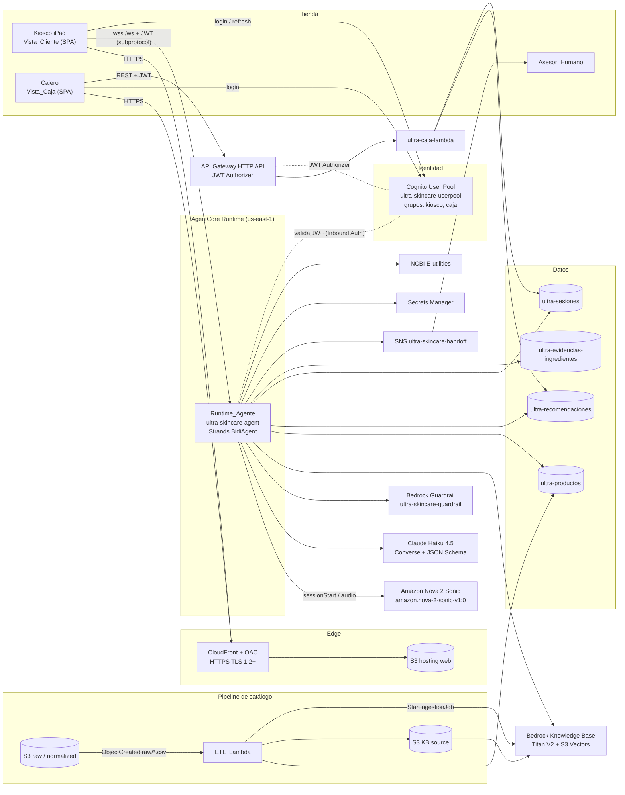
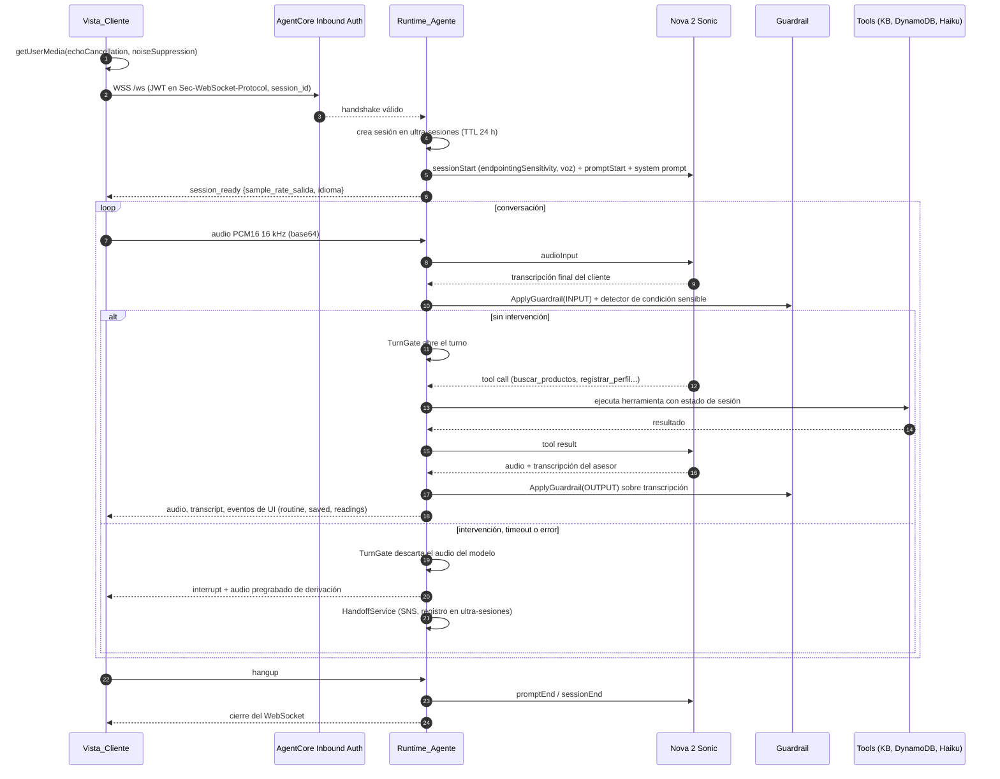
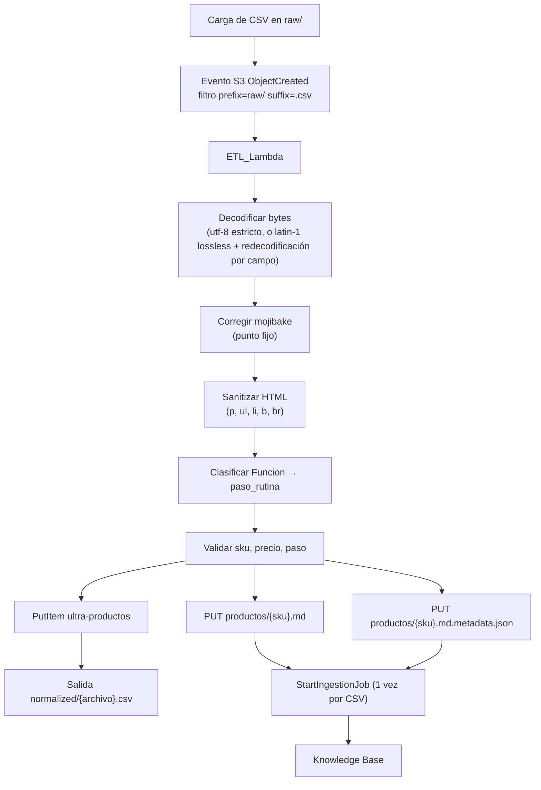
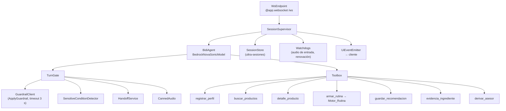
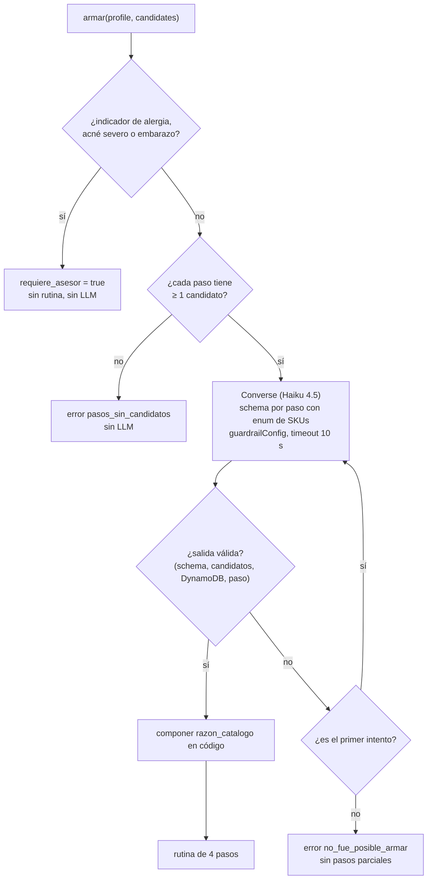
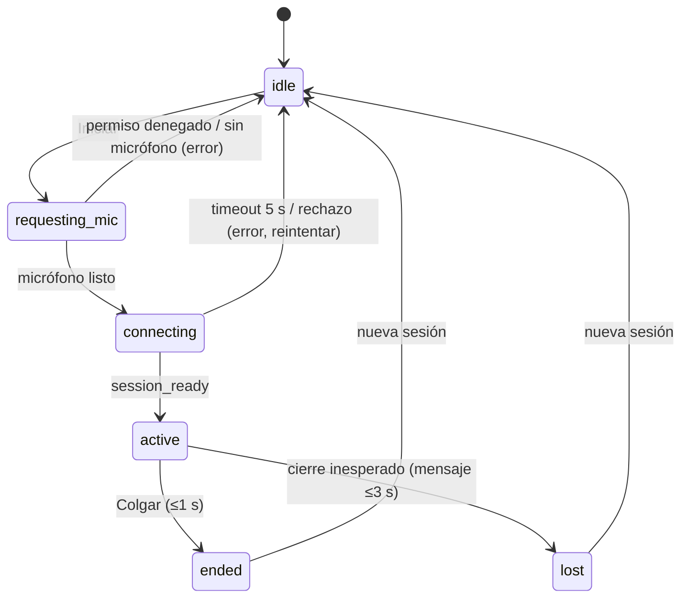
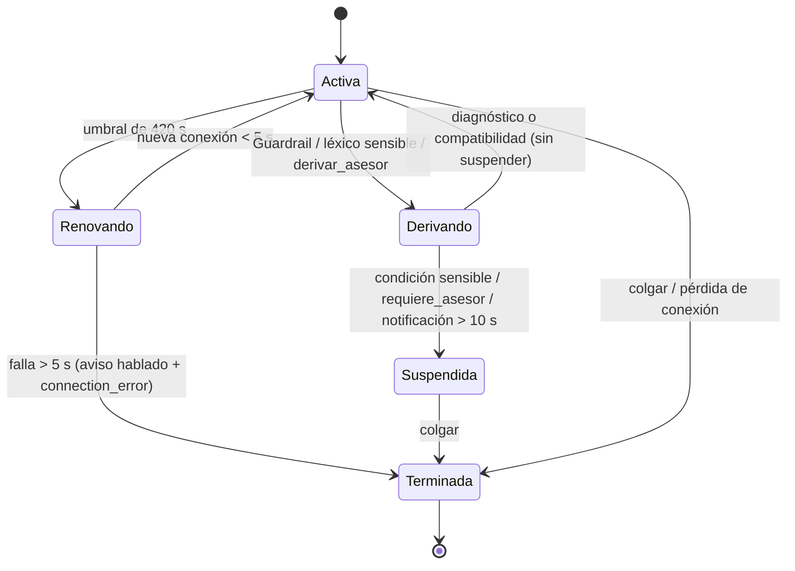

# Design Document

## Overview

El Asesor Virtual de Skincare por Voz de Grupo Ultra (Ultrafemme Cancún) es un sistema con cuatro piezas que trabajan sobre una cuenta AWS dedicada en `us-east-1`:

1. **Pipeline de catálogo (ETL + Knowledge Base).** Una Lambda convierte el CSV del catálogo en registros limpios (UTF-8, sin HTML, clasificados en 4 pasos) y los publica en DynamoDB (`ultra-productos`) y en una Knowledge Base de Bedrock (Titan Text Embeddings V2 + S3 Vectors).
2. **Agente de voz.** Un contenedor Python 3.12 ARM64 en Amazon Bedrock AgentCore Runtime, con Strands `BidiAgent` + Amazon Nova 2 Sonic, expone `/ws` y conduce la conversación. Las herramientas del agente consultan el catálogo, arman la rutina con Claude Haiku 4.5 (API Converse con salida estructurada), guardan la recomendación y, opcionalmente, consultan PubMed.
3. **Vista_Cliente (Kiosco).** SPA React/Vite/Tailwind que captura el micrófono, reproduce la voz, muestra transcripción, rutina, QR y código corto.
4. **Vista_Caja + API_Caja.** SPA para cajeros autenticados con Cognito y una HTTP API con una Lambda que consulta la rutina por `rec_id` o código corto y la marca como atendida.

### Principios de diseño

- **El catálogo es la única fuente de verdad.** Ningún dato de producto (SKU, nombre, precio, beneficios) llega a la rutina por boca del modelo de voz. Los datos se leen de `ultra-productos` en el servidor y el estado de la sesión vive del lado del servidor.
- **El modelo propone, el código dispone.** Toda salida de un LLM se valida con código determinista (JSON Schema, pertenencia a candidatos, existencia en DynamoDB) antes de usarse.
- **Fallar hacia el asesor humano.** Ante condiciones sensibles, errores del Guardrail o fallas de herramientas, el sistema deriva a un `Asesor_Humano` en lugar de improvisar.
- **Lógica pura separada de I/O.** Las reglas (limpieza de texto, clasificación, validación de rutina, generación de código, formato de dinero, máquinas de estado) son funciones puras para poder probarlas con property-based testing.

### Resumen de decisiones de diseño

| ID | Decisión | Razón |
|---|---|---|
| DD-01 | Una sola voz políglota: **`tiffany`** (en-US, femenina), configurable por `NOVA_VOICE_ID` ∈ {`tiffany`, `matthew`}. Cierra Req. 5.10. | La documentación de Nova 2 Sonic solo describe a Tiffany y Matthew como voces políglotas que hablan los 7 idiomas soportados, incluido español. `lupe` y `carlos` son voces es-US, pero no se documentan como políglotas. La voz se fija en `promptStart`, así que no se puede cambiar de voz a mitad de sesión sin reiniciar la conexión. Una sola voz garantiza que no cambie el género (Req. 5.12). Se elige la femenina por el perfil de la marca. Se valida en piloto (S-09). |
| DD-02 | El JWT viaja en el handshake del navegador por el header `Sec-WebSocket-Protocol`: `["base64UrlBearerAuthorization.<token-base64url>", "base64UrlBearerAuthorization"]`. Cierra S-10. | AgentCore Runtime documenta este mecanismo para navegadores, que no pueden poner el header `Authorization`. El `session_id` va como query param `X-Amzn-Bedrock-AgentCore-Runtime-Session-Id`. |
| DD-03 | El Kiosco obtiene su token con un **usuario de servicio por dispositivo** en el grupo `kiosco`. El iPad se aprovisiona una vez y guarda un refresh token. Cierra la opción (a) de S-06. | Las identidades no autenticadas de un identity pool no generan JWT de user pool. El cliente sigue siendo anónimo para el usuario final. |
| DD-04 | `Codigo_Corto` con formato **`LLL-DDD`**: 3 letras y 3 dígitos. Letras sin `I` ni `O`, dígitos del 2 al 9. Cierra S-02. | Es un subconjunto válido de Req. 13.2 (letras A-Z y dígitos 0-9) y es compatible con la validación de Req. 20.8 (3 letras, guion, 3 dígitos). Evita confusiones al digitarlo. Hay 24³ × 8³ ≈ 7.07 M combinaciones. |
| DD-05 | El Guardrail se aplica **explícitamente con `ApplyGuardrail`** sobre las transcripciones del cliente y del asesor, y con `guardrailConfig` en cada llamada Converse del Motor_Rutina. | La ficha de modelo de Nova 2 Sonic lista Guardrails como no soportado en el endpoint `bedrock-runtime`. |
| DD-06 | Las herramientas trabajan sobre **estado de sesión del servidor**. `armar_rutina()` y `guardar_recomendacion()` no reciben datos de productos del modelo de voz. | Un LLM de voz puede transcribir mal un SKU o un precio. El estado del servidor garantiza que la rutina guardada es la que se armó y validó. |
| DD-07 | `razon_catalogo` **se compone en código** a partir de fragmentos verbatim de la columna Beneficios. El LLM solo elige SKUs e índices de beneficios. | Cumple por construcción Req. 11.2 a 11.4: no hay texto libre del modelo. |
| DD-08 | Los mensajes de seguridad (bloqueo del Guardrail, derivación, "no te escucho", "la conversación va a terminar") son **audios pregrabados ES/EN** con la misma voz, generados en build. | Deben sonar en ≤2 s aun cuando Nova 2 Sonic esté caído o el Guardrail falle (Req. 12.4, 12.6, 24.10). |
| DD-09 | El archivo de metadata de la KB se llama **`productos/{sku}.md.metadata.json`** y usa el envoltorio `{"metadataAttributes": {...}}`. | Bedrock exige `nombre-de-archivo.extensión.metadata.json`. `productos/{sku}.metadata.json` (texto literal de Req. 4.2, 4.3, 4.7, 4.8) no sería leído por la KB. Ver "Desviaciones". |
| DD-10 | `Herramienta_Guardar` se ejecuta **dentro del Runtime_Agente** como librería, sin Lambda intermedia. | Req. 22.8 solo define dos Lambdas (ETL y Caja). Evita un salto de red y una Lambda más. |
| DD-11 | La Renovacion_Conexion usa el restart nativo de `BidiAgent` (`connection={"restart_after_s": N}`) más un `SessionSupervisor` propio que persiste el contexto y vigila los tiempos (2 s y 5 s). Si el restart nativo no cumple Req. 24.9/24.10 en el spike de la Fase 3, el supervisor orquesta el reinicio con el historial guardado. | Evita reimplementar lo que ya ofrece el SDK y deja una salida si falla la medición. |
| DD-12 | En la API_Caja el dinero viaja como **cadena decimal** (`"1234.50"`), no como float. El total se calcula con `Decimal` en servidor y con centavos enteros en cliente. | Evita errores de punto flotante en "suma exacta" (Req. 15.2) y conserva los 2 decimales. |
| DD-13 | El JWT Authorizer de la HTTP API acepta como audiencia **ambos** clientes (KioscoClient y CajaClient). La Lambda exige `cognito:groups` ⊇ `caja`. | Permite responder **403** a un JWT válido sin grupo `caja` (Req. 21.4). Si el Authorizer solo aceptara CajaClient, ese caso daría 401. |
| DD-14 | La derivación usa **SNS** (`ultra-skincare-handoff`) para notificar y un endpoint `POST /derivaciones/{session_id}/confirmar` en la API_Caja para la confirmación. Es una **extensión** sobre los requerimientos. | Req. 12.7 y 9.7 exigen "notificar" y "confirmar recepción", pero no definen el canal. Requiere decisión del usuario (ver "Puntos abiertos"). |

## Architecture

### Vista general



### Flujo de una sesión de voz



### Reparto en stacks de CloudFormation

| Stack | Archivo | Contenido principal |
|---|---|---|
| `ultra-skincare-storage` | `01-base-storage-db.yaml` | 4 buckets S3 (hosting, logs, raw data, KB source), 4 tablas DynamoDB on-demand, llave KMS, Budget con alerta (exactamente lo que pide Req. 22.6). |
| `ultra-skincare-auth` | `02-auth-cognito.yaml` | User Pool `ultra-skincare-userpool`, grupos `kiosco` y `caja`, app clients `KioscoClient` y `CajaClient`. |
| `ultra-skincare-bedrock` | `03-bedrock-kb-guardrail.yaml` | Guardrail `ultra-skincare-guardrail`, S3 Vectors bucket e índice, Knowledge Base, data source sobre el bucket KB source. |
| `ultra-skincare-compute` | `04-api-and-lambdas.yaml` | ETL_Lambda, `ultra-caja-lambda`, HTTP API con JWT Authorizer, rol de ejecución del Runtime_Agente, repositorio ECR `ultra-skincare-agent`, tópico SNS `ultra-skincare-handoff`, roles IAM con nombre. |
| `ultra-skincare-frontend` | `05-frontend-hosting.yaml` | CloudFront, OAC, política de bucket, redirección HTTP→HTTPS, security headers. |

Orden de despliegue (Req. 22.4): storage → auth → bedrock → compute → frontend. `CAPABILITY_NAMED_IAM` se incluye en storage y compute (Req. 22.5). El Runtime_Agente **no** es un recurso de los 5 stacks: se construye y publica en ECR, se despliega en AgentCore con `agentcore deploy` y se valida con un script de smoke test (Req. 22.9, 22.10, 22.13). Recibe por variables de entorno los nombres de tablas, IDs de KB y Guardrail, y el discovery URL del User Pool.

### Flujo del pipeline de catálogo



El original en `raw/` nunca se modifica. La salida va a `normalized/`, fuera del prefijo que dispara el evento, para evitar bucles.

## Components and Interfaces

### 1. ETL_Lambda (`src/etl/`)

Python 3.12. Dependencias: `ftfy`, `boto3` (incluido en el runtime). Se usa el módulo estándar `csv` en lugar de pandas para mantener la Lambda ligera y conservar todos los valores como texto (el SKU `000375947` no debe perder ceros a la izquierda). En local (Fase 1) el mismo núcleo se ejecuta como script `etl_catalog.py`.

Configuración de la función: memoria 1024 MB, timeout 300 s, `MaximumRetryAttempts: 0` en la invocación asíncrona (un reintento automático reprocesaría el CSV y lanzaría otro `StartIngestionJob`). El evento S3 filtra `prefix=raw/` y `suffix=.csv`.

Funciones puras (sin I/O), todas en `etl/core/`:

| Función | Firma | Comportamiento |
|---|---|---|
| `decode_rows` | `(data: bytes) -> (rows, skipped: list[int])` | Intenta decodificar todo el archivo como UTF-8 estricto (con BOM opcional). Si falla, lee el archivo como `latin-1` (conversión 1:1 de bytes a caracteres, sin pérdida), parsea el CSV y, por campo, reinterpreta los bytes como UTF-8 estricto y luego como cp1252 estricto. Una fila con algún campo que no decodifica se omite y su número de fila (base 1, encabezado = fila 1) se agrega a `skipped`. |
| `fix_mojibake` | `(s: str) -> str` | Llama a `ftfy.fix_encoding` y repite hasta punto fijo (máximo 3 iteraciones). Solo repara mojibake; no cambia comillas, ligaduras ni normalización Unicode. |
| `sanitize_html` | `(v: Any) -> Any` | Si `v` no es `str` o es vacío, lo devuelve igual. Si no contiene ninguna etiqueta objetivo, lo devuelve igual carácter por carácter. Si contiene alguna: `li` y `p` se convierten en saltos de línea, `br` en salto, `ul` y `b` se eliminan, y se repite hasta que no quede ninguna etiqueta objetivo (una eliminación puede formar otra etiqueta, por ejemplo `<<b>p>`). Después se colapsan a lo más 2 saltos consecutivos y se recortan espacios y saltos al inicio y al final. |
| `classify_funcion` | `(funcion: str, mapping: Mapping[str,str]) -> str \| None` | Busca `funcion.strip().casefold()` en el mapa. Devuelve uno de los 4 pasos o `None`. |
| `normalize_brand` | `(s: str, aliases) -> str` | `strip`, colapso de espacios internos, `upper()`, y aplicación de `brand_aliases` (por ejemplo `LANCOME → LANCÔME`). |
| `normalize_skin_type` | `(s: str) -> str` | Mapea a `Grasa`, `Seca`, `Mixta` o `Todo tipo de piel`. Un valor desconocido se registra y se asigna `Todo tipo de piel`. |
| `parse_price` | `(s: str) -> Decimal \| None` | Quita `$`, comas y espacios; cuantiza a 2 decimales (`ROUND_HALF_UP`). Devuelve `None` si no es numérico, es negativo o excede 999,999.99. |
| `build_product` | `(row, cfg) -> Product \| Omit` | Compone el registro con los 12 atributos del Diccionario de Datos más `detalle`, o devuelve un motivo de omisión (`sku_invalido`, `paso_no_mapeado`, `precio_invalido`). |
| `render_kb_markdown` | `(p: Product) -> str` | Documento en español por SKU con nombre, marca, paso, tipo de piel, precio, beneficios, ingredientes y detalle. Un documento es un chunk (la data source usa `ChunkingStrategy: NONE`). |
| `render_kb_metadata` | `(p: Product) -> dict` | `{"metadataAttributes": {"paso_rutina", "tipo_piel", "marca", "precio"}}`, con los mismos valores guardados en `ultra-productos`. |

Capa de I/O (`etl/handler.py`):

1. Lee el objeto, llama a `decode_rows`, construye productos y acumula los omitidos (sku + motivo).
2. Escribe en paralelo (hasta 32 hilos) `PutItem` en `ultra-productos` y los dos objetos de la KB por SKU. Un fallo de un SKU se registra con SKU y descripción, y el proceso continúa. Un SKU repetido en el CSV conserva la última fila y se registra una advertencia.
3. Escribe `normalized/{archivo}.csv` (UTF-8, columnas limpias más `paso_rutina`). Si el archivo está vacío, sin encabezado legible o es ilegible, registra el error con nombre y causa, **no** genera salida y deja `raw/` intacto.
4. Cuando termina de escribir, llama a `bedrock-agent:StartIngestionJob` **una vez** si escribió al menos un SKU. Si devuelve error, registra descripción y nombre del CSV, conserva lo escrito y termina con falla.
5. Registra el total de filas omitidas y de productos omitidos (con SKU y motivo). Si hubo cualquier fallo de escritura o de `StartIngestionJob`, lanza una excepción al final para que la ejecución quede en estado de falla.

El mapa `Funcion → paso` (`funcion_map.json`, unas 50 variantes) y el mapa de encabezados del CSV (`column_map`, insensible a mayúsculas y acentos) viven como archivos de configuración versionados. Se generan en la Fase 1 a partir de los valores distintos del CSV real (ver "Puntos abiertos").

### 2. Knowledge Base

- Embeddings: Amazon Titan Text Embeddings V2 (`amazon.titan-embed-text-v2:0`). Cierra S-05.
- Vector store: S3 Vectors (`AWS::S3Vectors::VectorBucket` + `Index`), referenciado desde `StorageConfiguration.Type: S3_VECTORS`.
- Data source: bucket `ultra-skincare-kb-source`, prefijo `productos/`, `ChunkingStrategy: NONE`.
- Consulta: `bedrock-agent-runtime:Retrieve` con filtro de metadata `equals` sobre `paso_rutina`. El filtro por `tipo_piel` y por presupuesto se aplica en código como **preferencia de ranking**, no como filtro duro, para no producir cero candidatos por un filtro demasiado estricto y para no depender de operadores de filtro que S3 Vectors pudiera no soportar.
- El SKU no está en la metadata (Req. 4.3 fija 4 campos), así que se extrae de `location.s3Location.uri` (`.../productos/{sku}.md`).

### 3. Runtime_Agente (`src/agent/`)

Contenedor Python 3.12 ARM64. Puerto 8080, ruta `/ws`. Usa `BedrockAgentCoreApp` con el decorador `@app.websocket`. El handshake es validado por AgentCore Inbound Auth (JWT de Cognito, `allowedClients = [KioscoClient]`) **antes** de que el contenedor reciba la conexión. Por eso un handshake sin JWT válido no crea ningún registro en `ultra-sesiones` (Req. 21.2, 21.12).



#### 3.1 Configuración (variables de entorno)

| Variable | Predeterminado | Validación |
|---|---|---|
| `NOVA_MODEL_ID` | `amazon.nova-2-sonic-v1:0` | Cadena. La documentación de Strands ya muestra `amazon.nova-2-5-sonic`; el ID va por configuración para poder cambiarlo sin tocar código. |
| `NOVA_VOICE_ID` | `tiffany` | Debe ser `tiffany` o `matthew`. Otro valor usa `tiffany` y se registra. |
| `ENDPOINTING_SENSITIVITY` | `MEDIUM` | `HIGH`, `MEDIUM` o `LOW` (exacto). Otro valor usa `MEDIUM` y registra el valor recibido (Req. 6.2). |
| `NOVA_RESTART_AFTER_S` | `420` | Número con 0 < n < 480. Otro valor usa 420 y registra el valor (Req. 24.4). |
| `OUTPUT_SAMPLE_RATE` | `24000` | 16000 o 24000. |
| `GUARDRAIL_ID`, `GUARDRAIL_VERSION` | — | Obligatorias. |
| `ROUTINE_MODEL_ID` | `us.anthropic.claude-haiku-4-5-20251001-v1:0` | Perfil de inferencia de Claude Haiku 4.5. Se verifica el ID exacto en la Fase 2. |
| `KB_ID` | — | Obligatoria. |
| `BUDGET_TIER_BOUNDS_MXN` | `800,2000` (a calibrar) | Dos números crecientes: fronteras entre `$`, `$$` y `$$$`. |
| `PUBMED_ENABLED` | `false` | Habilita `evidencia_ingrediente`. |
| `STORE_DOMAIN` | — | Dominio para la URL del QR. |

#### 3.2 Configuración de Nova 2 Sonic

```python
model = BedrockNovaSonicModel(
    model_id=cfg.nova_model_id,
    region="us-east-1",
    voice=cfg.voice_id,                              # "tiffany"
    audio={"input": {"sample_rate": 16000},
           "output": {"sample_rate": cfg.output_sample_rate}},
    params={"turnDetectionConfiguration":
                {"endpointingSensitivity": cfg.endpointing_sensitivity}},
    connection={"restart_after_s": cfg.restart_after_s},
)
agent = BidiAgent(model=model, tools=toolbox.tools(session),
                  system_prompt=build_system_prompt(), messages=restored_messages)
```

`endpointingSensitivity` se envía de forma explícita en cada conexión (incluidas las renovaciones). El inicio de la conversación lo da el agente con un turno de texto interno que pide el saludo. El saludo es bilingüe y corto ("Hi! / ¡Hola!"), y el asesor adopta el idioma del primer turno del cliente.

Cuota a considerar: Nova 2 Sonic admite 20 sesiones bidireccionales concurrentes por cuenta y región, cuota no ajustable. Es suficiente para un Kiosco por tienda; limita el crecimiento multi-tienda.

#### 3.3 Protocolo WebSocket Kiosco ↔ Runtime

Marcos JSON de texto (AgentCore entrega `receive_json`).

Cliente → servidor:

| `type` | Campos | Significado |
|---|---|---|
| `audio` | `data` (PCM16 LE mono 16 kHz, base64) | Marco de micrófono de ~40 a 100 ms. |
| `hangup` | — | El cliente colgó. |

Servidor → cliente:

| `type` | Campos | Significado |
|---|---|---|
| `session_ready` | `session_id`, `output_sample_rate`, `voice` | La sesión de audio está abierta (≤5 s). |
| `audio` | `data` (PCM16 LE, base64) | Audio del asesor. |
| `interrupt` | — | Vaciar la cola de reproducción (barge-in o bloqueo). |
| `transcript` | `role` (`cliente`\|`asesor`), `text`, `final` | Transcripción en vivo. |
| `routine` | `pasos[4]` (ver Data Models) | Rutina validada, lista para pintar. |
| `saved` | `rec_id`, `codigo_corto`, `qr_url` | Recomendación guardada. |
| `readings` | `ingrediente`, `articulos[≤5]` | Tarjeta de lecturas PubMed. |
| `handoff` | `motivo`, `estado` | Derivación iniciada, pendiente o confirmada. |
| `connection_error` | `reason` (`renewal_failed`, `nova_unavailable`, ...) | La voz terminó, la rutina y el QR siguen visibles. |
| `info` | `code` | Avisos (por ejemplo `audio_input_stalled`). |

#### 3.4 Estado de sesión (`SessionState`)

Se mantiene en memoria y se persiste en `ultra-sesiones` cada vez que cambia (Req. 24.6). Contiene: `profile`, `exchange_count`, `candidates` (por paso), `routine`, `readings`, `language`, `handoff`, `recommendations_suspended`, `messages` (historial para el restart, acotado a 200 KiB) y `created_at`/`ttl`.

`SessionStore.load(session_id, now)` trata como inexistente una sesión con `now >= created_at + 86400 s`, aunque DynamoDB aún no haya borrado el ítem (el borrado por TTL puede tardar). Devuelve un error "iniciar nueva sesión" (Req. 21.11).

#### 3.5 Herramientas expuestas al modelo

Todas son asíncronas, con timeout propio. Ninguna recibe datos de producto del modelo.

| Herramienta | Entrada del modelo | Comportamiento y salida |
|---|---|---|
| `registrar_perfil` (T0) | `campo` ∈ {`tipo_piel`, `inquietud`, `textura`, `presupuesto`, `indicador_sensible`}, `valor` | Aplica `ProfileState.apply` (ver 3.6). Devuelve `{exchange_count, faltan[], listo_para_proponer, reformular}`. Un `indicador_sensible` dispara la derivación. |
| `buscar_productos` (T1) | `paso` ∈ 4 pasos, `consulta` (opcional) | `KnowledgeBase.Retrieve` con filtro `paso_rutina` (timeout 5 s), hidratación con `BatchGetItem` a `ultra-productos`, ranking por `tipo_piel` y presupuesto, top 5. Guarda los candidatos completos en `SessionState.candidates[paso]`. Devuelve una vista reducida al modelo. Si no hay candidatos: `{"sin_candidatos": true}`. Si falla o expira: `{"error": "catalogo_no_disponible"}`. |
| `detalle_producto` (T2) | `sku` | Solo acepta SKUs presentes en `SessionState.candidates`. Devuelve `modo_uso`, `ingredientes`, `detalle` desde DynamoDB. Un campo vacío se devuelve como `null`. |
| `armar_rutina` (T3) | — | Llama a `MotorRutina.armar(profile, candidates)`. Devuelve `{ok, pasos_resumen}` o `{requiere_asesor: true}` o `{error, pasos_sin_candidatos?}`. Emite el evento `routine` a la Vista_Cliente. |
| `guardar_recomendacion` (T4) | — | Llama a `Herramienta_Guardar.guardar(session.routine, session)`. Emite `saved`. Devuelve el `codigo_corto` para que el asesor lo mencione. |
| `evidencia_ingrediente` (T5, opcional) | `ingrediente` | Ver 3.9. Devuelve al modelo **solo** `{"lecturas_en_pantalla": true\|false}`. |
| `derivar_asesor` | `motivo` ∈ {`condicion_sensible`, `diagnostico`, `compatibilidad`} | Dispara `HandoffService`. |

Si `recommendations_suspended` es verdadero, `buscar_productos`, `armar_rutina` y `guardar_recomendacion` devuelven `{"error": "recomendacion_suspendida"}`.

El prompt del sistema (`prompts.py`) fija: catálogo cerrado, respuesta textual de Req. 8.2 en español y su traducción al inglés (Req. 8.5), idioma del último turno del cliente, prohibición de hablar de compatibilidad química y de diagnósticos, y lectura de resultados de herramientas (`sin_candidatos`, `catalogo_no_disponible`, `requiere_asesor`, `lecturas_en_pantalla`).

#### 3.6 `ProfileState` (función pura)

Máquina de estados determinista que aplica las reglas de Req. 7 sobre cuatro campos.

```python
Categorias = {
  "tipo_piel":   {"grasa/acneica", "normal/equilibrada", "mixta/deshidratada", "seca/tensa"},
  "inquietud":   {"brotes", "manchas", "hidratacion", "primeras_lineas", "arrugas_profundas/firmeza"},
  "presupuesto": {"$", "$$", "$$$"},
  "textura":     str,   # valor único libre
}
```

- `apply(state, campo, valor)` acepta un valor solo si es exactamente una categoría válida. Si no lo es (ambiguo, múltiple, "no sé"), la primera vez devuelve `reformular=true`; la segunda vez marca el campo como `no_proporcionado` y pasa al siguiente (Req. 7.9).
- `exchange_count` cuenta turnos agente→cliente (Req. 7.2).
- `listo_para_proponer = (todos los campos resueltos o no_proporcionados) y exchange_count ≥ 5`, o `exchange_count ≥ 10` (Req. 7.6, 7.7). En el segundo caso se marca `basado_en_info_parcial=true` para que el asesor lo diga en voz.
- La pantalla no tiene formularios ni listas de preguntas (Req. 7.1).

#### 3.7 Motor_Rutina (`armar_rutina`)



- **JSON Schema por solicitud.** Se construye un objeto con las cuatro propiedades obligatorias `limpieza`, `tratamiento`, `hidratacion`, `proteccion_solar`. Cada una es `{sku: enum[SKUs candidatos de ese paso], beneficios_idx: [int]}`, con `additionalProperties: false`. Además lleva `requiere_asesor: boolean`. El `enum` deja al modelo elegir solo entre candidatos del paso correcto; la validación posterior repite todo (defensa en profundidad).
- **Llamada.** `bedrock-runtime:Converse` con `outputConfig.textFormat` (salida estructurada JSON con el schema), `guardrailConfig` con `ultra-skincare-guardrail` en el 100% de las llamadas, `inferenceConfig.temperature` baja, y un cliente boto3 con `read_timeout=10` y `max_attempts=1`, para que las 2 invocaciones máximas incluyan todos los reintentos. Si el runtime no acepta `outputConfig` para este modelo, el respaldo es *tool use* forzado con el mismo schema.
- **Presupuesto total.** Un intento consume ≤10 s. Con un reintento el tope es 20 s desde la ejecución de `armar_rutina` (Req. 10.6).
- **Validación de la salida** (`validate_routine_output`, función pura): cumple el schema; exactamente 4 pasos; cada SKU ∈ candidatos del paso; cada SKU existe en `ultra-productos`; `paso_rutina` del registro coincide; `beneficios_idx` dentro de rango. Un `stopReason` de intervención del Guardrail cuenta como fallo del intento.
- **`razon_catalogo`.** El código separa Beneficios en elementos (por líneas o viñetas) y concatena los elementos elegidos con un espacio, en una sola línea, truncando en límite de palabra a ≤200 caracteres. Si Beneficios está vacío: `razon_catalogo = ""`, se conserva el producto y se agrega `sin_beneficios: true` (Req. 11.6).
- **Resultado.** Cada paso de la rutina se hidrata desde DynamoDB: `paso` (1 a 4), `sku`, `nombre`, `marca`, `precio`, `imagen_url`, `razon_catalogo`, `modo_uso`.

#### 3.8 Herramienta_Guardar

`guardar(routine, session) -> SaveResult` es una función de librería; el wrapper de herramienta la invoca con la rutina del estado de sesión.

1. **Validar** (`validate_routine_for_save`, pura): exactamente 4 objetos; cada uno con `paso` entero 1 a 4 (sin repetidos), `sku`, `nombre`, `marca`, `imagen_url`, `razon_catalogo`, `modo_uso` como `str`, y `precio` numérico entre 0 y 999,999.99 con máximo 2 decimales. Verifica con `BatchGetItem` que los 4 SKUs existan en `ultra-productos`. Si algo falla, devuelve un error con el campo o los SKUs inválidos y no escribe nada (Req. 13.5, 13.6, 23.7).
2. **Reasignar desde el catálogo.** `nombre`, `marca`, `precio`, `imagen_url` y `modo_uso` se releen de `ultra-productos`. La rutina guardada no depende de lo que haya en memoria.
3. **Generar `rec_id`** (UUID v4) y **`codigo_corto`** con `generate_codigo_corto()`. Comprueba unicidad consultando el GSI `codigo_corto-index`; si existe, reintenta, con un máximo de 5 intentos.
4. **Escribir** con un `PutItem` condicionado a `attribute_not_exists(rec_id)`: `estado="pendiente"`, `fecha_creacion` ISO 8601 UTC con sufijo `Z`. Completa en ≤3 s (timeout del cliente DynamoDB de 2 s).
5. **Lecturas PubMed.** Si la sesión tiene lecturas, después de la escritura principal hace un `UpdateItem` que agrega `lecturas_pubmed`. Si esa segunda escritura falla, la recomendación **se conserva** y el resultado incluye `warning: "lecturas_no_almacenadas"` (Req. 17.8).
6. Si la escritura principal falla o se agotan los 5 intentos: error `no_se_guardo`, sin `rec_id` ni código, sin registro parcial.

Nota de diseño: un GSI no impone unicidad y es eventualmente consistente, así que dos sesiones simultáneas podrían obtener el mismo código. Con unas 7 M de combinaciones y un volumen de cientos de recomendaciones al día por tienda, la probabilidad es despreciable para el MVP. Si crece, la salida es reservar el código con una transacción sobre un ítem de reserva.

`generate_codigo_corto()` toma 3 letras de `ABCDEFGHJKLMNPQRSTUVWXYZ` y 3 dígitos de `23456789` con `secrets.choice`, y las une con guion.

#### 3.9 Consultor_PubMed (`evidencia_ingrediente`)

1. **Restricción** (`ingredient_in_routine`, pura): normaliza nombre y textos de ingredientes (NFKD, sin marcas diacríticas, `casefold`), separa `ingredientes` por comas y saltos de línea, y acepta el ingrediente si coincide con algún elemento completo. Si no pertenece a la rutina, devuelve rechazo **sin** leer caché, sin llamar a NCBI y sin escribir en `ultra-evidencias-ingredientes` (Req. 16.2).
2. **Caché.** Clave = ingrediente normalizado. Vigente si `now - fetched_at ≤ 30 días`; además `ttl` para el borrado automático. Si hay un resultado vigente, se devuelve sin llamar a NCBI.
3. **NCBI.** API Key desde Secrets Manager. `eSearch` (retmax = 5) y `eSummary`, timeout 5 s en cada llamada. Un éxito, incluso con 0 artículos, se guarda en la caché. Una falla de NCBI o de Secrets Manager devuelve respuesta vacía sin escribir en la caché.
4. **Presentación.** Si hay 1 o más artículos, emite el evento `readings` a la Vista_Cliente y agrega las lecturas a `SessionState.readings`. Al modelo solo le devuelve `{"lecturas_en_pantalla": true}`; **nunca ve títulos, PMID ni resúmenes**, de modo que no puede verbalizarlos (Req. 17.4). Con 0 artículos o fallo (o más de 10 s en total), devuelve `false` y el prompt indica no mencionar lecturas (Req. 17.7).

#### 3.10 TurnGate y Guardrail

`TurnGate` es el componente que separa a Nova 2 Sonic de la Vista_Cliente. Reenvía al cliente el audio y la transcripción del modelo solo cuando el turno está autorizado.

1. Al llegar la **transcripción final** del cliente, lanza en paralelo `ApplyGuardrail(source=INPUT)` (timeout 3 s) y `SensitiveConditionDetector`.
2. El audio que el modelo produce para ese turno **espera** el resultado (máximo 3 s). Agrega poca latencia porque la respuesta del modelo tarda en empezar.
3. **Sin intervención:** el turno se autoriza y el audio fluye. La transcripción del asesor también pasa por `ApplyGuardrail(source=OUTPUT)` a medida que se completa cada oración. Si interviene, se envía `interrupt`, se descarta el audio pendiente y se aplica el camino de bloqueo.
4. **Intervención, detección sensible, timeout o error** (falla cerrada, Req. 12.6): descarta la salida del modelo del turno, envía `interrupt`, reproduce el audio pregrabado de bloqueo (≤200 caracteres, en el idioma vigente, sin reproducir ni parafrasear lo bloqueado) y llama a `HandoffService`.

Limitación conocida: Nova 2 Sonic produce audio en streaming. La evaluación de salida sobre la transcripción llega después de que se emiten las primeras palabras, por lo que mitiga pero no evita del todo una respuesta dañina ya iniciada. La protección fuerte está en la entrada (la respuesta espera la decisión) y en que las herramientas nunca entregan al modelo contenido clínico.

`SensitiveConditionDetector` es un léxico ES/EN (embarazo, embarazada, pregnant, alergia severa, allergic reaction, acné quístico, cystic acne, herida, wound, psoriasis, dermatitis, rosácea, pus, sangrado, etc.), insensible a mayúsculas y acentos. Busca falsos positivos antes que falsos negativos. Se complementa con el juicio del modelo (`registrar_perfil(indicador_sensible)`) y con los temas denegados del Guardrail.

`LanguageTracker` (pura) decide el idioma vigente (`en`/`es`) a partir de la transcripción final de cada turno del cliente, contando palabras funcionales de cada idioma; en empate conserva el idioma anterior. Elige el idioma del audio pregrabado.

#### 3.11 HandoffService

Entrada: `motivo` ∈ {`condicion_sensible`, `diagnostico`, `compatibilidad`, `requiere_asesor`} y el perfil capturado.

1. Escribe el registro de derivación en `ultra-sesiones` (motivo, perfil, hora, `estado = "pendiente"`) y publica en SNS con el motivo, el perfil, el `session_id` y un enlace de confirmación. Debe terminar en ≤3 s desde la detección (Req. 9.1, 9.2, 9.3, 9.8).
2. Envía al cliente el evento `handoff`.
3. **Sin notificación en 10 s** (fallo de SNS): reproduce el audio "acuda al mostrador de asesoría en piso" y fija `recommendations_suspended = true` el resto de la sesión (Req. 9.7).
4. **Sin confirmación en 30 s:** un ciclo consulta `ultra-sesiones` cada 2 s. Al cumplirse 30 s sin `estado = "confirmada"`, reproduce una vez "un asesor lo atenderá en breve" en el idioma vigente, y mantiene la derivación activa hasta la confirmación (Req. 12.7).
5. Para los motivos `condicion_sensible` y `requiere_asesor` se fija `recommendations_suspended = true` (no se presenta ninguna rutina en la sesión, Req. 9.1, 9.5). Para `diagnostico` y `compatibilidad` la conversación puede continuar con otros temas.

#### 3.12 Supervisor de sesión, renovación de conexión y watchdogs

- **Renovación (Req. 24).** `BidiAgent` reinicia la conexión tras `restart_after_s` y reenvía el historial. El `SessionSupervisor` escucha `BidiConnectionRestartEvent`, actualiza `ultra-sesiones`, mantiene abierto el WebSocket con la Vista_Cliente y arranca un temporizador de 5 s: si la nueva conexión no entrega su primer evento a tiempo, envía `connection_error(renewal_failed)` y reproduce el audio pregrabado "la conversación va a terminar". El tramo sin audio en ambos sentidos se mide y se compara con 2 s (objetivo a validar en piloto). El saludo inicial no se repite porque el historial restaurado ya lo contiene; los datos de perfil se repiten en el prompt restaurado para que no se vuelvan a preguntar.
- **Audio de entrada detenido (Req. 6.9).** Si pasan más de 3 s sin marcos `audio` del cliente mientras la sesión está activa, detiene la salida (`interrupt`), reproduce una vez "no te escucho" y conserva el estado.
- **Barge-in (Req. 6.8).** Ante `BidiInterruptionEvent` envía `interrupt` al cliente; el cliente vacía su cola de reproducción. Objetivo ≤500 ms (a validar en piloto).
- **Latencia.** Se registra la métrica `ResponseLatencyMs` (transcripción final del cliente → primer audio del asesor) en CloudWatch EMF para contrastarla con el umbral de Req. 5.2 (S-03).
- **Cierre.** `hangup` o cierre del WebSocket: `promptEnd` y `sessionEnd` hacia Nova, cierre de la sesión.

### 4. Vista_Cliente (`src/frontend/`, componente `Kiosk.tsx`)

React + Vite + Tailwind. Estado con un reductor (`useReducer`) y un hook `useVoiceSession`.



Módulos:

| Módulo | Responsabilidad |
|---|---|
| `auth/kioskAuth.ts` | Aprovisionamiento único (pantalla `/kiosk/setup` para TI) y renovación del access token con `REFRESH_TOKEN_AUTH` en `KioscoClient` antes de cada conexión. |
| `voice/wsClient.ts` | Abre el WebSocket con `encodeBearerSubprotocol(token)`, `session_id` UUID en query param, timeout de 5 s, y emite eventos tipados. |
| `voice/micCapture.ts` + `worklets/pcm16-capture.js` | `getUserMedia({audio: {echoCancellation: true, noiseSuppression: true}})`, `AudioWorklet`, remuestreo a 16 kHz si el `AudioContext` no corre a 16 kHz, conversión Float32 → Int16, marcos de ~64 ms. |
| `voice/playback.ts` + `worklets/pcm16-playback.js` | Cola de reproducción a `output_sample_rate`. `flush()` al recibir `interrupt`. |
| `components/ListeningIndicator` | Pulso verde mientras hay audio de entrada o salida; se detiene ≤300 ms después; texto "El asesor sigue escuchando"; `aria-live="polite"`. |
| `components/Transcript` | Lista con emisor, desplazamiento automático y `role="log"`. |
| `components/RoutineGrid` + `ProductCard` | 4 columnas ≥1024 px, 2 entre 600 y 1023, 1 por debajo de 600; tarjeta de reemplazo si falta un paso; imagen con `onError` que cambia a imagen de reemplazo. |
| `components/UsagePopover` | Popover accesible: abre ≤300 ms, cierra al abrir otro, con Escape, con botón o clic fuera, y devuelve el foco. |
| `components/CheckoutCard` | "PARA LA CAJA": QR (`qrcode.react`, lienzo de 512 px, mostrado a ≥256 px CSS), código en monoespaciada ≥24 px con contraste ≥7:1. |
| `components/ReadingsCard` | "LECTURAS [INGREDIENTE]", hasta 5 títulos de ≤150 caracteres y la leyenda exacta de Req. 17.3. |
| `components/SafetyFooter` | Aviso de asesoría en piso y uso responsable, ≥12 px, contraste ≥4.5:1, visible en todas las pantallas. |

Funciones puras en `src/frontend/lib/`: `encodeBearerSubprotocol`/`decodeBearerSubprotocol`, `floatToPcm16`/`pcm16ToFloat`, `downsample`, `formatMXN`, `truncate`, `columnsForWidth`, `buildQrUrl`, `parseQrUrl`, `readingsViewModel`, `productCardViewModel`.

Los rótulos de la pantalla siguen los wireframes en español. Los lectores de pantalla anuncian cambios del estado de escucha con una región `aria-live`. El orden de tabulación sigue el orden visual.

### 5. API_Caja y `ultra-caja-lambda` (`src/caja_api/`)

HTTP API con JWT Authorizer de Cognito (`issuer` = User Pool; audiencia = ambos clientes, DD-13). CORS restringido al dominio de CloudFront.

| Ruta | Acción |
|---|---|
| `GET /recomendacion/{id}` | `id` es un `rec_id` (UUID v4) o un `codigo_corto`. Devuelve la recomendación. |
| `POST /recomendacion/{id}/atendida` | Marca como atendida. Idempotente. |
| `POST /derivaciones/{session_id}/confirmar` | Extensión DD-14: el asesor confirma la derivación. |

Lógica de la Lambda:

1. **Autorización.** Lee `requestContext.authorizer.jwt.claims`. Si `cognito:groups` no incluye `caja`: **403**. La ausencia o invalidez del JWT la resuelve el Authorizer con **401**, sin invocar la Lambda (Req. 22.12).
2. **Resolución del id** (`classify_id`, pura): si coincide con UUID v4 → consulta por clave; si tras `strip().upper()` coincide con `^[A-Z]{3}-\d{3}$` → consulta el GSI `codigo_corto-index`; otro formato → **400** `codigo_invalido`. El patrón de la Lambda es más amplio que el alfabeto de generación (DD-04) a propósito: no rechaza un código bien formado y deja que la consulta responda 404. No existe → **404** `no_encontrada`. Nunca devuelve datos de otra recomendación.
3. **Respuesta** (Req. 15.1): `rec_id`, `codigo_corto`, `fecha_creacion`, `estado` (`PENDIENTE`/`ATENDIDA`), `fecha_atendida?`, `productos[4]` ordenados por `paso` con `sku`, `nombre`, `marca`, `precio` (cadena decimal con 2 decimales), `imagen_url`, y `total_sugerido` (suma exacta con `Decimal`). Lee el snapshot guardado en la recomendación, no `ultra-productos`, para devolver "la misma Rutina guardada".
4. **Marcar atendida.** `UpdateItem` con `ConditionExpression: estado = :pendiente` que fija `estado="atendida"`, `fecha_atendida` (ISO 8601 UTC) y `cajero_id` (claim `username`, con `sub` como respaldo) en una sola operación. Si falla la condición, lee el ítem y responde 200 con los valores originales sin cambiarlos (idempotencia). Un error de DynamoDB responde **500** sin modificar nada.
5. **Confirmar derivación.** `UpdateItem` sobre `ultra-sesiones` que fija `handoff.estado = "confirmada"`.

La función tiene timeout de 10 s y un objetivo de respuesta ≤3 s. El rol IAM concede solo `GetItem`, `Query` sobre el índice y `UpdateItem` en las tablas necesarias.

### 6. Vista_Caja (`src/frontend/`, componente `Cashier.tsx`)

| Pantalla / módulo | Detalle |
|---|---|
| `LoginScreen` | Encabezado "GRUPO ULTRA · CAJA", título y texto fijados por Req. 19. Usuario (máx. 64) y Contraseña (máx. 128, oculta). Valida campos vacíos sin enviar. Al autenticar deshabilita "Entrar"; con credenciales rechazadas conserva el usuario, vacía la contraseña y no indica cuál campo falló; con falta de red o timeout de 10 s muestra un mensaje de conexión distinto y conserva ambos valores. |
| `auth/cajaAuth.ts` | `amazon-cognito-identity-js` (SRP) con `CajaClient`. Tokens en `sessionStorage`. Un 401 o un JWT vencido cierra la sesión local, muestra "la sesión expiró" y conserva el código ingresado. |
| `OperationalScreen` | Botones "Activar Cámara Escáner" (`html5-qrcode`) y "Subir Foto de QR" (`Html5Qrcode.scanFile`, JPEG/PNG ≤10 MB), campo Código `[ABC-123]` y "Buscar". Convierte el código a mayúsculas antes de validar `^[A-Z]{3}-\d{3}$`. |
| `lib/cajaApi.ts` | `fetch` con `AbortController` a 10 s. |
| `RoutineResult` | "Rutina Identificada: #<Codigo_Corto> \| <DD/MM/AAAA> \| Estado: <ESTADO>", tabla de 4 filas ordenadas por PASO con SKU, PRODUCTO, PASO y PRECIO, "TOTAL SUGERIDO" en `$#,###.## MXN`, y botón "MARCAR COMO ATENDIDA Y COMPLETAR DESPACHO" habilitado solo si el estado es PENDIENTE. |

`parseQrUrl(text)` extrae `rec` de una URL `https://<dominio>/caja?rec=<uuid>`; valida que sea UUID v4 y que el host coincida con el dominio de la tienda. Si falla, muestra el mensaje de ingresar el código manualmente. Si la cámara se deniega, muestra el mensaje y mantiene disponibles la carga de foto y el código manual.

### 7. Cognito

- User Pool `ultra-skincare-userpool`: inicio de sesión por usuario y contraseña, política de contraseña reforzada, sin autorregistro.
- Grupos: `kiosco` y `caja` (exactamente dos).
- App clients (exactamente dos, públicos, sin secreto):
  - `KioscoClient`: `ALLOW_USER_PASSWORD_AUTH` (solo para el aprovisionamiento) y `ALLOW_REFRESH_TOKEN_AUTH`. Access token de 60 min; refresh token de larga vida (365 días, a calibrar).
  - `CajaClient`: `ALLOW_USER_SRP_AUTH` y `ALLOW_REFRESH_TOKEN_AUTH`.
- Compromiso de seguridad del Kiosco: el refresh token de un iPad robado permitiría abrir sesiones de voz (costo). Se mitiga con la revocación del usuario de servicio (`AdminUserGlobalSignOut`, `AdminDisableUser`), con el Budget con alertas, y porque `KioscoClient` solo es válido en el Runtime (en la API_Caja el grupo `caja` lo rechaza con 403).

### 8. IAM, cifrado y hosting

- **IAM de mínimo privilegio** (Req. 21.9): sin acciones `*` y sin recurso `*` donde el servicio admite permisos por recurso. Roles con nombre: `ultra-skincare-etl-role`, `ultra-skincare-caja-role`, `ultra-skincare-agent-runtime-role`.
  - ETL: `s3:GetObject` en `raw/*`, `s3:PutObject` en `normalized/*` y en `productos/*` del bucket KB source, `dynamodb:PutItem` en `ultra-productos`, `bedrock:StartIngestionJob` sobre la KB.
  - Runtime: `bedrock:InvokeModelWithBidirectionalStream` sobre Nova 2 Sonic; `bedrock:InvokeModel`/`Converse` sobre el perfil de inferencia de Haiku y los modelos de respaldo; `bedrock:ApplyGuardrail` sobre el Guardrail; `bedrock:Retrieve` sobre la KB; `dynamodb` acotado por tabla (`GetItem`, `BatchGetItem`, `PutItem`, `UpdateItem`, `Query` sobre el GSI); `sns:Publish`; `secretsmanager:GetSecretValue` del secreto de PubMed.
  - Caja: `GetItem`, `Query` y `UpdateItem` sobre `ultra-recomendaciones` y su GSI; `UpdateItem` sobre `ultra-sesiones`.
- **KMS:** una llave para S3 y DynamoDB.
- **S3 hosting:** `PublicAccessBlock` completo; política que permite lectura solo a la distribución de CloudFront mediante OAC (Req. 21.7).
- **CloudFront:** `ViewerProtocolPolicy: redirect-to-https`, `MinimumProtocolVersion: TLSv1.2_2021` (Req. 21.6, 21.10), cabeceras de seguridad (CSP que permita `connect-src` a `wss://bedrock-agentcore.us-east-1.amazonaws.com`, al endpoint de Cognito y a la API, y `img-src` a los hosts de las imágenes de producto), `Permissions-Policy: microphone=(self), camera=(self)`.
- **Aislamiento de red (Req. 22.2):** el despliegue no incluye ninguna integración con ERP o SAP. Las únicas salidas del Runtime son servicios AWS y NCBI E-utilities (opcional).

## Data Models

### Tabla `ultra-productos`

Clave de partición `sku` (String, 1 a 64 caracteres). On-demand, cifrada con la llave KMS. Atributos según el Diccionario de Datos: `nombre`, `marca`, `paso_rutina`, `funcion_original`, `tipo_piel`, `precio` (Number), `beneficios`, `ingredientes`, `modo_uso`, `imagen_url`, `producto_url`. Se agrega además `detalle` (columna Detalle del CSV, ya sanitizada), porque Req. 2 la limpia y `detalle_producto` (T2) debe poder devolverla; Req. 4.1 exige "todos los atributos del Diccionario" y no prohíbe atributos adicionales (ver "Desviaciones").

Invariantes: `paso_rutina ∈ {Limpieza, Tratamiento, Hidratación, Protección solar}`; `0 ≤ precio ≤ 999,999.99` con máximo 2 decimales; `marca` normalizada.

### Tabla `ultra-recomendaciones`

Clave de partición `rec_id` (UUID v4). GSI `codigo_corto-index` con clave de partición `codigo_corto` (proyección `ALL`).

```json
{
  "rec_id": "3f0c6a0e-6f0f-4d0e-9d6b-8f1f3e2a9c11",
  "codigo_corto": "ABC-234",
  "session_id": "b1c6...",
  "fecha_creacion": "2026-10-05T18:45:00Z",
  "estado": "pendiente",
  "fecha_atendida": "2026-10-05T19:02:11Z",
  "cajero_id": "caja-01",
  "rutina": [
    {"paso": 1, "sku": "000375947", "nombre": "...", "marca": "CLINIQUE",
     "precio": 1234.50, "imagen_url": "https://...", "razon_catalogo": "...", "modo_uso": "..."}
  ],
  "lecturas_pubmed": [
    {"ingrediente": "ácido salicílico",
     "articulos": [{"titulo": "...", "pmid": "12345678"}]}
  ]
}
```

- `fecha_atendida` y `cajero_id` aparecen solo cuando `estado = "atendida"`.
- `rutina` tiene exactamente 4 objetos, con `paso` 1 a 4 (Limpieza, Tratamiento, Hidratación, Protección solar), en ese orden.
- `estado` vive a nivel de la recomendación (ver "Desviaciones").
- `codigo_corto` se guarda con guion (`ABC-234`), 6 caracteres alfanuméricos más el guion de presentación.

### Tabla `ultra-sesiones`

Clave de partición `session_id` (UUID). Atributo `ttl` (epoch, `created_at + 86400`) como atributo TTL de DynamoDB.

```json
{
  "session_id": "b1c6...",
  "created_at": 1759689900,
  "ttl": 1759776300,
  "language": "es",
  "profile": {"tipo_piel": "mixta/deshidratada", "inquietud": "manchas",
              "textura": "ligera", "presupuesto": "$$",
              "no_proporcionado": [], "exchange_count": 6},
  "candidates": {"Limpieza": [{"sku": "..."}], "Tratamiento": [], "Hidratación": [], "Protección solar": []},
  "routine": null,
  "readings": [],
  "messages": [{"role": "user", "content": [{"text": "..."}]}],
  "handoff": {"motivo": "condicion_sensible", "estado": "pendiente", "perfil": {}, "fecha": "..."},
  "recommendations_suspended": false
}
```

`messages` se trunca a 200 KiB de historial reciente y cada mensaje a 50 KiB, los mismos límites que aplica Strands al reenviar el historial. El ítem de DynamoDB admite hasta 400 KB, así que `candidates` se guarda reducido (solo SKUs y datos mínimos) y se rehidrata desde `ultra-productos`.

### Tabla `ultra-evidencias-ingredientes`

Clave de partición `ingrediente` (normalizado: NFKD, sin diacríticos, `casefold`). Atributos: `articulos` (lista de `{titulo, pmid}`, 0 a 5), `fetched_at` (ISO 8601 UTC), `ttl` (epoch, +30 días).

### Metadata y documento de la Knowledge Base

`productos/{sku}.md`:

```markdown
# {nombre}
**SKU:** {sku}
**Marca:** {marca}
**Paso de la rutina:** {paso_rutina}
**Tipo de piel:** {tipo_piel}
**Precio (MXN):** {precio}

## Beneficios
{beneficios}

## Ingredientes
{ingredientes}

## Detalle
{detalle}
```

`productos/{sku}.md.metadata.json`:

```json
{"metadataAttributes": {"paso_rutina": "Limpieza", "tipo_piel": "Mixta", "marca": "CLINIQUE", "precio": 1234.5}}
```

### Contratos JSON internos

**Entrada del Motor_Rutina** (construida en el servidor):

```json
{
  "perfil": {"tipo_piel": "...", "inquietud": "...", "textura": "...", "presupuesto": "$$",
             "indicadores_sensibles": []},
  "candidatos": {
    "Limpieza": [{"sku": "...", "nombre": "...", "marca": "...", "precio": "...",
                  "tipo_piel": "...", "beneficios": ["...", "..."]}],
    "Tratamiento": [], "Hidratación": [], "Protección solar": []
  }
}
```

**Schema de salida del modelo** (generado por solicitud; `<SKUs_x>` = SKUs candidatos del paso):

```json
{
  "type": "object",
  "additionalProperties": false,
  "required": ["requiere_asesor", "limpieza", "tratamiento", "hidratacion", "proteccion_solar"],
  "properties": {
    "requiere_asesor": {"type": "boolean"},
    "limpieza":         {"$ref": "#/$defs/paso_limpieza"},
    "tratamiento":      {"$ref": "#/$defs/paso_tratamiento"},
    "hidratacion":      {"$ref": "#/$defs/paso_hidratacion"},
    "proteccion_solar": {"$ref": "#/$defs/paso_proteccion"}
  },
  "$defs": {
    "paso_limpieza": {
      "type": "object", "additionalProperties": false, "required": ["sku", "beneficios_idx"],
      "properties": {"sku": {"enum": ["<SKUs_limpieza>"]},
                     "beneficios_idx": {"type": "array", "items": {"type": "integer", "minimum": 0}}}
    }
  }
}
```

(Los otros tres `$defs` son análogos, con su propio `enum`.)

**Salida del Motor_Rutina** hacia el agente y la Vista_Cliente:

```json
{"ok": true,
 "pasos": [{"paso": 1, "sku": "...", "nombre": "...", "marca": "...", "precio": "1234.50",
            "imagen_url": "...", "razon_catalogo": "...", "modo_uso": "...", "sin_beneficios": false}]}
```

o `{"ok": false, "requiere_asesor": true}` o `{"ok": false, "error": "pasos_sin_candidatos", "pasos": ["Tratamiento"]}` o `{"ok": false, "error": "no_fue_posible_armar"}`.

**Respuesta de la API_Caja** (`GET /recomendacion/{id}`), con dinero como cadena decimal (DD-12):

```json
{"rec_id": "...", "codigo_corto": "ABC-234", "fecha_creacion": "2026-10-05T18:45:00Z",
 "estado": "PENDIENTE", "fecha_atendida": null,
 "productos": [{"paso": 1, "sku": "...", "nombre": "...", "marca": "...",
                "precio": "1234.50", "imagen_url": "..."}],
 "total_sugerido": "4321.00"}
```

**URL del QR:** `https://<STORE_DOMAIN>/caja?rec=<rec_id>`.

### Tablas de mapeo

| Mapeo | Valores |
|---|---|
| `tipo_piel` del perfil → valor del catálogo (para el ranking) | `grasa/acneica` → `Grasa`; `normal/equilibrada` → `Todo tipo de piel`; `mixta/deshidratada` → `Mixta`; `seca/tensa` → `Seca`. Siempre se considera compatible `Todo tipo de piel`. |
| `presupuesto` → rango de precio (preferencia) | `$` < frontera1; `$$` entre frontera1 y frontera2; `$$$` > frontera2, con `BUDGET_TIER_BOUNDS_MXN`. |
| Paso ↔ número de `paso` | Limpieza = 1, Tratamiento = 2, Hidratación = 3, Protección solar = 4. |

## Correctness Properties

*Una propiedad es una característica o comportamiento que debe cumplirse en todas las ejecuciones válidas de un sistema; en esencia, una afirmación formal sobre lo que el sistema debe hacer. Las propiedades son el puente entre las especificaciones legibles por personas y las garantías de corrección verificables por máquina.*

**Reflexión de propiedades.** Del análisis previo se consolidó lo siguiente para evitar redundancia:

- Los criterios 1.2 (reparación) y 1.4 (idempotencia e identidad) quedan como dos propiedades distintas; 1.3 se cubre con la propiedad de decodificación de filas.
- 3.1, 3.6 y 3.7 se funden en una sola propiedad de clasificación con dos ramas (mapeado / no mapeado).
- 6.2 y 24.4 comparten forma ("entrada arbitraria → valor seguro") y se verifican en una propiedad de configuración con dos funciones.
- 7.3, 7.4, 7.5, 7.8 y 7.9 se funden en una propiedad de categorías y reformulación; 7.2, 7.6 y 7.7 en una de disponibilidad para proponer.
- 10.3, 10.4 y 10.5 se funden en una propiedad de validación de la salida del modelo. 11.1, 11.2, 11.3, 11.5 y 11.6 en una de composición de `razon_catalogo` (11.3 se sigue de 11.2 porque no hay texto libre).
- 13.9, 13.10, 13.1, 13.4, 17.6 y 23.4 se funden en una propiedad de guardado y consulta.
- 15.9 y 21.4 son la misma regla de autorización por grupo.
- 14.6 y 20.8 se agrupan en una propiedad de validadores de entrada del cliente.
- 15.5 y 20.6 se funden en la propiedad del modelo de vista de Caja.
- 16.3, 16.4 y 16.5 se funden en una propiedad de comportamiento de caché.
- Se descartaron como propiedades (quedan como pruebas de ejemplo) las reglas triviales: columnas por ancho de pantalla (18.3) y campos vacíos del login (19.7).
- Los criterios de infraestructura (Req. 21 y 22), de latencia con servicios externos y de conducta del LLM no son propiedades; ver "Testing Strategy".

### Property 1: La reparación de mojibake recupera el texto original

*For any* texto limpio `s` compuesto por caracteres latinos, símbolos y comillas tipográficas, y *for any* corrupción de `s` obtenida al codificar en UTF-8 y decodificar como Latin-1 o Windows-1252, `fix_mojibake(corrupto)` SHALL ser igual a `s`.

**Validates: Requirements 1.2**

### Property 2: La corrección de codificación es idempotente y no altera texto limpio

*For any* cadena `x`, `fix_mojibake(fix_mojibake(x))` SHALL ser igual a `fix_mojibake(x)`; y *for any* cadena `x` sin secuencias mojibake, `fix_mojibake(x)` SHALL ser igual a `x`.

**Validates: Requirements 1.4**

### Property 3: La decodificación de filas omite exactamente las filas inválidas y produce UTF-8 limpio

*For any* archivo CSV formado por filas decodificables y filas con bytes no decodificables en posiciones arbitrarias, `decode_rows` SHALL devolver como omitidas exactamente las posiciones de las filas inválidas (base 1, encabezado = fila 1), conservar las demás filas, y la salida escrita SHALL ser UTF-8 válido sin el carácter U+FFFD y sin secuencias mojibake.

**Validates: Requirements 1.3, 1.5**

### Property 4: La sanitización de HTML elimina etiquetas, conserva el texto y es idempotente

*For any* texto al que se le insertan etiquetas `p`, `ul`, `li`, `b` y `br` en cualquier combinación de mayúsculas, formas (apertura, cierre, autocierre) y atributos, incluidas inserciones anidadas que forman otra etiqueta al quitar la primera, `sanitize_html` SHALL producir una salida que no contiene ninguna de esas etiquetas, cuyo texto sin espacios en blanco es igual al texto original sin etiquetas y sin espacios en blanco, sin más de 2 saltos de línea consecutivos ni espacios o saltos en los extremos, y `sanitize_html(sanitize_html(x))` SHALL ser igual a `sanitize_html(x)`.

**Validates: Requirements 2.1, 2.2, 2.4**

### Property 5: La sanitización de HTML es la identidad cuando no hay etiquetas objetivo

*For any* texto que no contiene ninguna de las etiquetas `p`, `ul`, `li`, `b` ni `br`, `sanitize_html(x)` SHALL ser igual a `x` carácter por carácter, y *for any* valor nulo, vacío o no textual, SHALL devolver el mismo valor.

**Validates: Requirements 2.3, 2.5**

### Property 6: La clasificación es total y fiel

*For any* valor de `Funcion`, si su forma normalizada (`strip` y `casefold`) está en el mapa, el producto SHALL recibir exactamente el paso del mapa y `funcion_original` SHALL ser igual al valor de origen sin cambios; si no está en el mapa, incluido el valor vacío, el producto SHALL quedar excluido de la carga y el log SHALL contener el SKU y el valor recibido.

**Validates: Requirements 3.1, 3.6, 3.7**

### Property 7: La normalización de marca es invariante a variantes de escritura e idempotente

*For any* marca y *for any* variante suya con distinta capitalización o espacios al inicio, al final o repetidos, `normalize_brand` SHALL producir el mismo resultado, y `normalize_brand(normalize_brand(m))` SHALL ser igual a `normalize_brand(m)`.

**Validates: Requirements 4.5**

### Property 8: La validación de productos acepta solo SKUs, pasos y precios válidos

*For any* fila del catálogo, `build_product` SHALL aceptar la fila si y solo si el `sku` tiene de 1 a 64 caracteres, el `paso_rutina` pertenece al conjunto {Limpieza, Tratamiento, Hidratación, Protección solar} y el precio es numérico, mayor o igual a 0 y menor o igual a 999,999.99 con máximo 2 decimales; en cualquier otro caso SHALL devolver un motivo de omisión y las demás filas SHALL seguir procesándose.

**Validates: Requirements 23.1, 23.5, 23.6, 23.8, 23.9**

### Property 9: Los artefactos de la Knowledge Base son consistentes con el registro

*For any* producto válido, el registro de `ultra-productos` SHALL contener todos los atributos del Diccionario de Datos, la clave del documento SHALL ser exactamente `productos/{sku}.md`, la clave de metadata SHALL ser exactamente `productos/{sku}.md.metadata.json`, y `metadataAttributes` SHALL contener exactamente los campos `paso_rutina`, `tipo_piel`, `marca` y `precio` con los mismos valores del registro.

**Validates: Requirements 4.1, 4.2, 4.3**

### Property 10: Reprocesar un CSV no duplica ni cambia el estado

*For any* conjunto de filas válidas, procesar el mismo CSV dos veces SHALL dejar el mismo contenido en `ultra-productos` y en el bucket KB source, con exactamente un registro y un par de archivos por SKU.

**Validates: Requirements 4.7**

### Property 11: Un fallo de escritura de un SKU no afecta a los demás

*For any* CSV y *for any* subconjunto de SKUs cuya escritura falla, todos los SKUs restantes SHALL quedar escritos, cada fallo SHALL registrarse con su SKU y descripción, y el procesamiento SHALL terminar en estado de falla.

**Validates: Requirements 4.8**

### Property 12: La lectura de configuración siempre produce un valor seguro

*For any* cadena de entorno para `ENDPOINTING_SENSITIVITY`, el valor resultante SHALL pertenecer a {HIGH, MEDIUM, LOW}, siendo MEDIUM (con registro del valor recibido) cuando la cadena no es exactamente uno de los tres; y *for any* valor de entorno para el umbral de renovación, el resultado SHALL ser un número mayor que 0 y menor que 480, siendo 420 (con registro) cuando la entrada no es un número de segundos en ese rango.

**Validates: Requirements 6.2, 24.4**

### Property 13: El idioma vigente sigue al idioma del último turno del cliente

*For any* secuencia de turnos del cliente, cada uno claramente en inglés o en español, el idioma vigente que calcula `LanguageTracker` tras cada turno SHALL ser el idioma de ese turno, y SHALL conservar el idioma anterior cuando el turno no permite decidir.

**Validates: Requirements 5.4**

### Property 14: La conversión a PCM16 preserva el audio dentro de la cuantización

*For any* arreglo de muestras de audio en el rango [-1, 1], `floatToPcm16` SHALL producir valores enteros dentro del rango de 16 bits y `pcm16ToFloat(floatToPcm16(x))` SHALL diferir de `x` en no más de 1/32768 por muestra; y el paso de bytes a base64 y de regreso SHALL ser la identidad.

**Validates: Requirements 5.5**

### Property 15: Una interrupción vacía la cola de reproducción

*For any* cola de marcos de audio pendientes, después del evento `interrupt` la cola SHALL quedar vacía y ninguno de los marcos previos SHALL reproducirse.

**Validates: Requirements 6.8**

### Property 16: El watchdog de audio de entrada se dispara solo tras más de 3 s de silencio del flujo

*For any* secuencia de instantes de llegada de marcos de audio de entrada, el watchdog SHALL detener la salida y emitir el aviso hablado una sola vez por hueco si y solo si el hueco entre marcos supera 3 s, y SHALL dejar el `SessionState` sin cambios.

**Validates: Requirements 6.9**

### Property 17: El contexto de sesión se conserva en el almacenamiento y en la renovación

*For any* `SessionState` (perfil, candidatos, rutina, lecturas, idioma e historial), almacenar y luego cargar SHALL devolver un estado igual, y el contexto construido para una Renovacion_Conexion SHALL contener el perfil, los candidatos, la rutina y el idioma iguales a los del estado.

**Validates: Requirements 24.5, 24.6**

### Property 18: Una sesión es válida exactamente durante sus primeras 24 horas

*For any* instante de creación `t0` y *for any* instante de consulta `t`, `SessionStore.load` SHALL devolver la sesión si y solo si `t < t0 + 86400 s`, aunque el ítem exista todavía físicamente, y el ítem creado SHALL tener `ttl = t0 + 86400`.

**Validates: Requirements 21.8, 21.11**

### Property 19: El perfil solo acepta categorías válidas y reformula una sola vez

*For any* secuencia de respuestas del cliente para los campos tipo de piel, inquietud, presupuesto y textura, cada campo SHALL quedar con exactamente una categoría válida de su conjunto (textura con un único valor), o pendiente, o `no_proporcionado`; una respuesta que no permite asignar exactamente una categoría SHALL provocar una única reformulación de ese campo, y una segunda respuesta inválida SHALL marcarlo `no_proporcionado`.

**Validates: Requirements 7.3, 7.4, 7.5, 7.8, 7.9**

### Property 20: El perfil está listo para proponer según el número de intercambios

*For any* estado de perfil, `listo_para_proponer` SHALL ser falso si `exchange_count < 5`, SHALL ser verdadero si los cuatro campos están resueltos (o `no_proporcionado`) y `exchange_count ≥ 5`, y SHALL ser verdadero si `exchange_count ≥ 10`, marcando `basado_en_info_parcial` cuando falten datos.

**Validates: Requirements 7.2, 7.6, 7.7**

### Property 21: Las herramientas solo manejan productos del catálogo devueltos en la sesión

*For any* resultado de la Knowledge Base, incluidos SKUs ausentes de `ultra-productos`, `buscar_productos` SHALL devolver únicamente productos que existen en `ultra-productos` y cuyo `paso_rutina` es el pedido, y SHALL devolver `sin_candidatos` cuando queden cero; y *for any* SKU que no esté en los candidatos de la sesión, `detalle_producto` y `armar_rutina` SHALL rechazarlo.

**Validates: Requirements 8.1, 8.4**

### Property 22: El detector de condiciones sensibles reconoce todo el léxico

*For any* texto que contenga un término del léxico de condiciones sensibles con cualquier combinación de mayúsculas, acentos y texto circundante, `SensitiveConditionDetector` SHALL dispararse.

**Validates: Requirements 9.1**

### Property 23: Un indicador sensible impide generar y presentar rutina

*For any* perfil con al menos un indicador de alergia, acné severo o embarazo, `armar_rutina` SHALL devolver `requiere_asesor: true`, sin pasos y sin invocar al LLM; y *for any* secuencia posterior de llamadas a `buscar_productos`, `armar_rutina` y `guardar_recomendacion` en esa sesión, SHALL devolverse `recomendacion_suspendida` y no SHALL emitirse ningún evento `routine`.

**Validates: Requirements 9.4, 9.5**

### Property 24: La derivación respeta los plazos de 10 s y 30 s

*For any* retraso o fallo en la notificación al asesor, si la notificación no se completa en 10 s SHALL reproducirse el aviso de mostrador y quedar suspendida la recomendación; y *for any* instante de confirmación posterior a 30 s, SHALL emitirse exactamente una vez el aviso "un asesor lo atenderá en breve" y la derivación SHALL permanecer activa hasta la confirmación.

**Validates: Requirements 9.7, 12.7**

### Property 25: La derivación entrega el motivo y el perfil sin cambios

*For any* motivo de derivación y *for any* perfil capturado, el registro en `ultra-sesiones` y el mensaje publicado SHALL contener el motivo y el perfil iguales a los recibidos.

**Validates: Requirements 9.8**

### Property 26: El TurnGate falla cerrado ante cualquier resultado del Guardrail que no sea aprobación

*For any* secuencia de fragmentos de audio del modelo y *for any* resultado de evaluación en {aprobado, intervino, timeout, error}, los fragmentos SHALL reenviarse al cliente si y solo si el resultado es aprobado; en los demás casos SHALL descartarse el audio, enviarse `interrupt`, iniciarse la derivación y reproducirse el mensaje pregrabado del idioma vigente, de máximo 200 caracteres, sin contener el texto bloqueado.

**Validates: Requirements 12.3, 12.4, 12.6**

### Property 27: La validación de la salida del modelo acepta solo rutinas correctas

*For any* salida del modelo (válida o mutada) y *for any* conjunto de candidatos, `validate_routine_output` SHALL aceptarla si y solo si tiene exactamente un SKU por cada uno de los 4 pasos, cada SKU pertenece a los candidatos de su paso, existe en `ultra-productos` y su `paso_rutina` coincide con el paso asignado.

**Validates: Requirements 10.3, 10.4, 10.5**

### Property 28: El Motor_Rutina hace a lo más 2 invocaciones y nunca devuelve rutinas parciales

*For any* secuencia de respuestas simuladas del LLM (válida, inválida, timeout, intervención del Guardrail), el Motor_Rutina SHALL realizar a lo más 2 invocaciones, todas con `guardrailConfig` del Guardrail configurado, y SHALL devolver una rutina completa de 4 pasos o un error sin pasos parciales.

**Validates: Requirements 10.6, 12.5**

### Property 29: Los pasos sin candidatos se reportan sin invocar al LLM

*For any* subconjunto de pasos con candidatos, si al menos un paso no tiene candidatos el Motor_Rutina SHALL devolver un error que liste exactamente los pasos sin candidatos y SHALL realizar 0 invocaciones al LLM.

**Validates: Requirements 10.8**

### Property 30: `razon_catalogo` se compone solo de fragmentos del catálogo

*For any* texto de Beneficios (incluidos vacío y ausente) y *for any* selección de índices, `razon_catalogo` SHALL tener a lo más 200 caracteres, no contener saltos de línea y ser una concatenación, posiblemente truncada en límite de palabra, de elementos de Beneficios; y cuando Beneficios esté vacío o ausente, SHALL ser la cadena vacía con `sin_beneficios = true` conservando el producto.

**Validates: Requirements 11.1, 11.2, 11.3, 11.5, 11.6**

### Property 31: Guardar valida la rutina completa antes de escribir

*For any* rutina (válida o mutada), `guardar` SHALL escribir si y solo si contiene exactamente 4 objetos con `paso` 1 a 4, todos los campos requeridos con el tipo correcto, `precio` entre 0 y 999,999.99 con máximo 2 decimales y 4 SKUs existentes en `ultra-productos`; en caso contrario SHALL rechazar la operación indicando el campo, la condición o los SKUs inválidos, sin insertar registro y sin devolver `rec_id` ni `codigo_corto`.

**Validates: Requirements 13.5, 13.6, 23.3, 23.7, 23.9**

### Property 32: El Codigo_Corto tiene el formato definido y es único dentro de 5 intentos

*For any* ejecución de `generate_codigo_corto`, el resultado SHALL coincidir con `^[A-HJ-NP-Z]{3}-[2-9]{3}$`; y *for any* conjunto de códigos existentes y *for any* número `k` de colisiones consecutivas, si `k < 5` el guardado SHALL tener éxito con un código distinto de todos los existentes, y si `k ≥ 5` SHALL fallar sin registro, sin `rec_id` y sin código.

**Validates: Requirements 13.2, 13.3, 13.11**

### Property 33: Guardar y consultar devuelve la misma recomendación por cualquier vía

*For any* rutina válida guardada (con o sin lecturas de PubMed), el `rec_id` SHALL ser un UUID v4 distinto en cada guardado, `estado` SHALL ser `pendiente`, `fecha_creacion` SHALL coincidir con `^\d{4}-\d{2}-\d{2}T\d{2}:\d{2}:\d{2}Z$`, y consultar por `rec_id`, por `codigo_corto` o por `codigo_corto` con cualquier combinación de mayúsculas y minúsculas SHALL devolver resultados idénticos, con los mismos 4 SKUs en el mismo orden y un registro por cada artículo de lecturas con ingrediente, título y PMID.

**Validates: Requirements 13.1, 13.4, 13.9, 13.10, 17.6, 23.4**

### Property 34: Un identificador desconocido o inválido no devuelve ni modifica datos

*For any* cadena que no sea un `rec_id` ni un código corto válido, la API_Caja SHALL responder con error de código inválido; y *for any* UUID o código con formato válido que no esté guardado, SHALL responder 404 sin datos de otra recomendación; en ambos casos la tabla `ultra-recomendaciones` SHALL quedar sin cambios.

**Validates: Requirements 13.12, 15.8**

### Property 35: La URL del QR hace ida y vuelta

*For any* UUID v4 y dominio de tienda, `buildQrUrl` SHALL producir exactamente `https://<dominio>/caja?rec=<rec_id>` y `parseQrUrl(buildQrUrl(id))` SHALL devolver `id`; *for any* texto que no sea esa URL con un UUID v4 válido, `parseQrUrl` SHALL rechazarlo.

**Validates: Requirements 13.7**

### Property 36: Marcar como atendida es idempotente y conserva al primer cajero

*For any* recomendación pendiente y *for any* secuencia de solicitudes de marcado por cajeros distintos, `estado` SHALL ser `atendida` tras la primera, `fecha_atendida` (ISO 8601 UTC) y `cajero_id` SHALL corresponder a la primera solicitud y permanecer sin cambios en las siguientes, todas respondiendo sin error; y un fallo de DynamoDB SHALL responder 500 sin modificar `estado`, `fecha_atendida` ni `cajero_id`.

**Validates: Requirements 15.3, 15.4, 15.6, 15.7**

### Property 37: Solo el grupo `caja` puede operar sobre recomendaciones

*For any* conjunto de claims, la `ultra-caja-lambda` SHALL ejecutar la operación si y solo si `cognito:groups` incluye `caja`; sin claims SHALL rechazar con error de autenticación, y con claims sin el grupo SHALL responder 403; en ambos rechazos SHALL no devolver datos ni modificar registros.

**Validates: Requirements 15.9, 21.4**

### Property 38: La respuesta de Caja tiene 4 productos ordenados y el total es la suma exacta

*For any* recomendación guardada, la respuesta SHALL contener los 4 productos ordenados por `paso` ascendente, cada uno con SKU, nombre, marca, imagen y precio con exactamente 2 decimales, el estado `PENDIENTE` o `ATENDIDA`, y `total_sugerido` igual a la suma exacta de los 4 precios en centavos.

**Validates: Requirements 15.1, 15.2, 20.4**

### Property 39: El formato MXN hace ida y vuelta

*For any* monto en centavos entre 0 y 99,999,999, `formatMXN` SHALL producir un texto que coincide con `^\$\d{1,3}(,\d{3})*\.\d{2} MXN$` y analizarlo SHALL devolver los mismos centavos.

**Validates: Requirements 20.5, 18.4**

### Property 40: El modelo de vista de Caja refleja el estado de la recomendación

*For any* recomendación, el botón "MARCAR COMO ATENDIDA Y COMPLETAR DESPACHO" SHALL estar habilitado si y solo si el estado es `PENDIENTE` (y deshabilitado cuando no hay recomendación), la vista de una recomendación `ATENDIDA` SHALL incluir `fecha_atendida`, y la fecha SHALL mostrarse en formato DD/MM/AAAA correspondiente a la fecha ISO.

**Validates: Requirements 15.5, 20.3, 20.6**

### Property 41: Los validadores de entrada de Caja aceptan solo lo permitido

*For any* cadena, `isValidCode` SHALL aceptarla si y solo si, tras `strip` y conversión a mayúsculas, coincide con `^[A-Z]{3}-\d{3}$`; y *for any* par (tipo, tamaño), `validateImage` SHALL aceptarlo si y solo si el tipo es `image/jpeg` o `image/png` y el tamaño es a lo más 10 MB.

**Validates: Requirements 14.6, 20.8**

### Property 42: PubMed solo se consulta para ingredientes de la rutina

*For any* rutina y *for any* nombre de ingrediente con cualquier combinación de mayúsculas y acentos, `ingredient_in_routine` SHALL aceptarlo si y solo si su forma normalizada coincide con un ingrediente normalizado de los productos de la rutina; y *for any* ingrediente rechazado, SHALL haber 0 llamadas a NCBI, 0 lecturas de la caché y 0 escrituras en `ultra-evidencias-ingredientes`.

**Validates: Requirements 16.1, 16.2**

### Property 43: La caché de PubMed se comporta según su vigencia

*For any* ingrediente de la rutina y *for any* antigüedad `a` de su entrada en caché, si `a ≤ 30 días` SHALL devolverse la entrada sin llamar a NCBI; si no hay entrada vigente SHALL llamarse a NCBI y devolverse a lo más 5 artículos en el orden recibido; una respuesta exitosa, incluso con 0 artículos, SHALL almacenarse con vigencia de 30 días; y una falla de NCBI o de Secrets Manager SHALL devolver una respuesta vacía sin escribir en la caché.

**Validates: Requirements 16.3, 16.4, 16.5, 16.6, 16.7**

### Property 44: La tarjeta de lecturas muestra los primeros 5 títulos en orden y truncados

*For any* lista de artículos devuelta por el Consultor_PubMed y *for any* ingrediente, el modelo de vista SHALL titularse `LECTURAS <INGREDIENTE>`, mostrar los primeros `min(n, 5)` títulos en el mismo orden, y cada título mostrado SHALL tener a lo más 150 caracteres y ser un prefijo del original, con puntos suspensivos cuando se truncó.

**Validates: Requirements 17.1, 17.2, 18.8**

### Property 45: El modelo de voz nunca recibe contenido de PubMed

*For any* resultado de PubMed (con cualquier número de artículos, títulos, resúmenes y PMID), el resultado que `evidencia_ingrediente` entrega al modelo SHALL ser únicamente `{"lecturas_en_pantalla": true|false}` y SHALL no contener ningún título, resumen ni PMID.

**Validates: Requirements 17.4**

### Property 46: El indicador de escucha está activo solo mientras hay audio reciente

*For any* secuencia de instantes de audio enviado o recibido y *for any* instante de consulta, el indicador SHALL estar activo si y solo si el último audio ocurrió hace menos de 300 ms, y el texto "El asesor sigue escuchando" SHALL mostrarse si y solo si la sesión está activa.

**Validates: Requirements 18.2, 18.12**

### Property 47: La tarjeta de producto muestra todos los campos y trunca la razón

*For any* producto de la rutina, el modelo de vista de la tarjeta SHALL incluir marca, nombre, SKU, precio con el formato `$#,###.## MXN` y el botón de modo de uso, y la razón SHALL tener a lo más 120 caracteres, terminando en puntos suspensivos cuando se truncó.

**Validates: Requirements 18.4**

### Property 48: Perder la conexión de voz conserva lo mostrado

*For any* estado de la Vista_Cliente con rutina, Codigo_QR, código corto y transcripción, los eventos de cierre inesperado, desconexión y `connection_error` SHALL dejar esos datos sin cambios y SHALL poner el indicador de escucha en inactivo.

**Validates: Requirements 18.13, 24.11**

### Property 49: La codificación del JWT en el subprotocolo hace ida y vuelta

*For any* token con el alfabeto de un JWT (base64url y puntos), `decodeBearerSubprotocol(encodeBearerSubprotocol(token))` SHALL ser igual al token y la cadena codificada SHALL contener solo caracteres base64url válidos, con el prefijo `base64UrlBearerAuthorization.`.

**Validates: Requirements 21.2**

## Error Handling

### Principios

1. **Nunca improvisar ante un fallo de seguridad.** Si el Guardrail no responde o falla, el turno se descarta y se deriva (Property 26).
2. **Nunca mostrar datos parciales de rutina.** Un error del Motor_Rutina o de `guardar` no deja estados intermedios visibles (Properties 28, 31).
3. **Degradar sin perder lo ya entregado.** Si la voz se pierde, la Vista_Cliente conserva rutina, QR, código y transcripción (Property 48).
4. **Registrar con contexto.** Todo error del ETL y del Runtime se registra en JSON estructurado con `request_id`, `session_id` o `sku` cuando aplique, sin incluir datos personales ni transcripciones completas.

### Catálogo de errores por componente

| Componente | Condición | Respuesta | Requisito |
|---|---|---|---|
| ETL | Fila no decodificable | Omitir, registrar fila (base 1) y total al final | 1.5, 1.6 |
| ETL | Archivo vacío, sin encabezado o ilegible | Error en log, sin salida, `raw/` intacto | 1.7 |
| ETL | Valor no textual en columna a sanitizar | Conservar el valor, registrar registro y columna | 2.6 |
| ETL | `Funcion` sin mapeo | Excluir el SKU y registrar SKU y valor | 3.7 |
| ETL | Paso, precio o SKU inválido | Omitir el producto, reportar SKU y motivo | 23.8 |
| ETL | Fallo de escritura de un SKU | Registrar, continuar, terminar en falla | 4.8 |
| ETL | `StartIngestionJob` falla (incluido conflicto por otro job en curso) | Registrar, conservar lo escrito, terminar en falla; el operador reintenta cargando de nuevo | 4.6 |
| Vista_Cliente | Micrófono denegado o ausente | Mensaje "se requiere acceso al micrófono"; no abre el WebSocket | 5.8 |
| Vista_Cliente | Sesión no se establece en 5 s o handshake rechazado | Mensaje de error; permite reintentar | 5.7 |
| Vista_Cliente | Cierre inesperado del WebSocket | Detiene micrófono y audio; mensaje en ≤3 s | 5.9, 18.13 |
| Runtime | Valor inválido de configuración | Usa el predeterminado y registra el valor | 6.2, 24.4 |
| Runtime | Entrada de audio detenida más de 3 s | Detiene salida, aviso hablado, conserva estado | 6.9 |
| Runtime | Sesión vencida (TTL de 24 h) | Trata como inexistente; mensaje de iniciar una nueva | 21.11 |
| Runtime | `buscar_productos` falla o excede 5 s | `catalogo_no_disponible`; el asesor lo dice y sugiere asesor humano | 8.6 |
| Runtime | Guardrail con intervención, timeout o error | Descarta la salida, deriva, mensaje pregrabado | 12.3, 12.4, 12.6 |
| Runtime | Notificación al asesor sin completarse en 10 s | Audio de mostrador; suspende recomendaciones | 9.7 |
| Runtime | Sin confirmación del asesor en 30 s | Aviso "un asesor lo atenderá en breve"; derivación activa | 12.7 |
| Runtime | Renovación de conexión sin éxito en 5 s | `connection_error(renewal_failed)` y aviso hablado | 24.10, 24.11 |
| Motor_Rutina | Salida inválida, timeout o Guardrail | Un reintento; después error `no_fue_posible_armar` en ≤20 s | 10.6, 10.7 |
| Motor_Rutina | Paso sin candidatos | Error con los pasos faltantes, sin llamar al LLM | 10.8 |
| Motor_Rutina | Indicador sensible | `requiere_asesor: true`, sin rutina | 9.4 |
| Guardar | Rutina inválida o SKU inexistente | Rechazo con detalle; sin registro | 13.6, 23.7 |
| Guardar | Escritura fallida o 5 colisiones | Error `no_se_guardo`; sin registro parcial | 13.11 |
| Guardar | Falla al almacenar lecturas | Conserva la recomendación; `warning` | 17.8 |
| PubMed | NCBI no responde en 5 s o error | Respuesta vacía; sin caché; la rutina sigue | 16.6, 17.7 |
| PubMed | API Key no disponible | Respuesta vacía; sin llamar a NCBI | 16.7 |
| API_Caja | Sin JWT, expirado o malformado | 401 del Authorizer, sin invocar la Lambda | 21.5, 22.12 |
| API_Caja | JWT sin grupo `caja` | 403 | 21.4 |
| API_Caja | Id de formato inválido | 400 `codigo_invalido`; sin escrituras | 15.8 |
| API_Caja | Recomendación inexistente | 404 | 13.12, 14.7 |
| API_Caja | Falla de DynamoDB al marcar | 500 sin modificar | 15.7 |
| Vista_Caja | API sin respuesta en 10 s o error de servidor | Mensaje de reintento; conserva el código | 14.11 |
| Vista_Caja | JWT vencido | Cierra sesión, pantalla de acceso con aviso; conserva el código | 14.10 |
| Vista_Caja | Imagen inválida o QR no decodificable | Mensaje de ingresar el código | 14.6 |
| Vista_Caja | Cámara denegada | Mensaje y métodos alternativos | 14.8 |
| Vista_Caja | Credenciales rechazadas / red caída | Mensajes distintos; se conserva lo tecleado según el caso | 19.6, 19.8 |
| Deploy | Falla de un stack | Se detiene, nombra el stack y la causa | 22.11 |
| Deploy | Falla de validación del Runtime | Indica si fue handshake, inglés o español | 22.13 |

### Degradación de la voz



### Riesgos y mitigaciones

| Riesgo | Mitigación |
|---|---|
| Nova 2 Sonic no soporta Guardrails de forma nativa y el audio sale en streaming | `TurnGate` retiene el audio hasta la decisión de entrada; evaluación de salida sobre transcripción con `interrupt`; herramientas que nunca entregan contenido clínico al modelo. |
| El modelo de voz transcribe mal SKUs o precios | El modelo no pasa datos de producto a las herramientas; todo sale del estado de sesión y de DynamoDB. |
| Refresh token de un Kiosco robado | Revocación del usuario de servicio, Budget con alertas, `KioscoClient` sin acceso a Caja. |
| Cuota de 20 sesiones concurrentes de Nova 2 Sonic | Suficiente para 1 Kiosco por tienda; reevaluar al escalar. |
| Colisión de `codigo_corto` entre sesiones simultáneas | Probabilidad despreciable en el MVP; salida documentada (ítem de reserva transaccional). |
| Fallos de reinicio de conexión del SDK | `SessionSupervisor` con temporizadores y plan B de reinicio propio desde `ultra-sesiones`. |

## Testing Strategy

### Enfoque dual

- **Pruebas de propiedades (PBT)** para la lógica pura y las máquinas de estado: las 49 propiedades de la sección anterior.
- **Pruebas unitarias y de ejemplo** para casos concretos, bordes y puntos de integración entre componentes.
- **Pruebas de integración** (1 a 3 ejemplos) para comportamientos de servicios AWS: evento S3, latencias de Nova, Authorizer, despliegue.
- **Evaluación conversacional** para la conducta del LLM (frases textuales, idioma, no verbalizar lecturas): se ejecuta como arnés con guiones, no como PBT.

### Dónde aplica y dónde no aplica PBT

| Área | ¿PBT? | Herramientas y razón |
|---|---|---|
| ETL puro (mojibake, HTML, clasificación, marca, precio, artefactos KB) | Sí | Python + **Hypothesis**. Funciones puras con espacio de entrada amplio. |
| ETL con I/O (reprocesamiento, aislamiento de fallos) | Sí, con dobles | Hypothesis + **moto** (S3, DynamoDB) y un cliente de Bedrock simulado. |
| Lógica del agente (perfil, derivación, TurnGate, watchdogs, Motor_Rutina, Guardar, PubMed, sesión) | Sí, con dobles | Hypothesis con un modelo de voz y un LLM simulados, reloj virtual (`freezegun` o reloj inyectable) y moto. |
| Lambda de Caja | Sí, con moto | Hypothesis + moto (DynamoDB). |
| Funciones puras del frontend | Sí | **fast-check** + Vitest. |
| Componentes React (popover, foco, aria, contraste) | No | Ejemplos con Testing Library, `axe-core` y revisión manual con VoiceOver. El renderizado visual no admite propiedades universales. |
| CloudFormation (5 stacks) | No | `cfn-lint`, `cfn-guard` (sin comodines IAM, HTTPS, OAC, bloqueo público) y pruebas de aserciones sobre las plantillas. |
| Latencia y calidad de voz (5.2, 5.3, 6.3 a 6.6, 24.9) | No | Pruebas de piloto con métricas y los bancos de 100 turnos de Req. 6. |
| Conducta del LLM (8.2, 8.3, 8.5, 17.5, 24.7, TC-01 a TC-06) | No | Arnés de evaluación con conversaciones guionadas y verificación de texto. |

### Configuración de las pruebas de propiedades

- Librerías: **Hypothesis** (Python) y **fast-check** (TypeScript). No se implementa PBT a mano.
- Mínimo **100 iteraciones** por propiedad (`@settings(max_examples=100)` y `fc.assert(..., {numRuns: 100})`).
- Cada propiedad se implementa con **una sola** prueba de propiedad.
- Cada prueba lleva un comentario de trazabilidad con el formato **Feature: skincare-voice-advisor, Property {n}: {texto de la propiedad}**.
- Los generadores incluyen los bordes relevantes: cadenas vacías, acentos y símbolos, mayúsculas y minúsculas mezcladas, SKUs con ceros a la izquierda, precios en los límites 0 y 999,999.99, etiquetas HTML anidadas de forma adversa, y relojes en los límites de 3 s, 5 s, 10 s, 30 s y 24 h.

### Pruebas unitarias y de ejemplo (selección)

- ETL: encabezados faltantes, archivo vacío, log de filas omitidas, una sola llamada a `StartIngestionJob`, error de `StartIngestionJob`, mapeos representativos por grupo de `Funcion`.
- Agente: configuración del modelo (voz `tiffany`, `endpointingSensitivity`, `restart_after_s`), que la renovación reenvíe `endpointingSensitivity`, parámetros de la llamada Converse (modelo, schema, `read_timeout=10`, `max_attempts=1`), WebSocket del cliente abierto durante un restart simulado, y aviso a los 5 s de una renovación fallida.
- Frontend: ausencia de formularios en la Vista_Cliente, `getUserMedia` con `echoCancellation` y `noiseSuppression`, colgar en ≤1 s, errores de micrófono y de conexión, popover de modo de uso (apertura, Escape, clic fuera, foco), guardia de ruta de Caja, flujos de login y de JWT vencido, columnas por ancho (4, 2 y 1), campos vacíos del login.
- Accesibilidad: `axe-core` en cada pantalla y revisión manual con lector de pantalla en el iPad. La conformidad completa con WCAG requiere pruebas manuales con tecnologías de apoyo y revisión experta; estas pruebas automatizadas no la certifican.

### Pruebas de integración y humo

- Subir un CSV a `raw/` y medir el inicio del ETL (≤60 s) y el fin (≤300 s con un archivo de ~50 MB).
- Handshake `wss://.../ws` con el subprotocolo desde un navegador real (Safari en iPad), y rechazo sin token (sin filas en `ultra-sesiones`).
- `smoke_test.py` del despliegue: handshake ≤10 s y un prompt en inglés y otro en español, cada uno con respuesta no vacía en el idioma del prompt en ≤30 s; reporta cuál validación falló.
- API_Caja: llamadas sin token, con token expirado y con token malformado (401), y con token de `KioscoClient` (403).
- Sesión de 15 minutos con al menos una renovación (Req. 24.1).
- Casos de aceptación TC-01 a TC-06 ejecutados en el entorno de pruebas.

### Pruebas de piloto (objetivos a validar)

Bancos de N = 100 turnos con grabaciones de ruido de la tienda piloto para Req. 6.4 y 6.5; 100 emisiones sin cliente para el eco (6.6); barge-in ≤500 ms (6.8); hueco de renovación ≤2 s (24.9); latencia de respuesta ≤2 s tras el fin de turno (5.2, 5.3; umbral S-03); acento y vocabulario mexicanos con la voz elegida (S-09).

### Fases de implementación y pruebas asociadas

Siguen la guía del documento de requerimientos: Fase 1 (ETL local, Properties 1 a 11), Fase 2 (Motor_Rutina y Guardrail, 23, 27 a 30), Fase 3 (agente de voz, 12, 13, 16 a 22, 24 a 26), Fase 4 (frontend, 14, 15, 35, 39 a 41, 44, 46 a 49), Fase 5 (backend serverless y PubMed, 31 a 34, 36 a 38, 42, 43 y 45), Fase 6 (IaC, pruebas de plantilla y humo). Cada fase incluye un *spike* corto para resolver los riesgos de integración detallados en "Puntos abiertos".

## Desviaciones y requerimientos que conviene ajustar

El diseño cumple la intención de cada requerimiento, pero en estos puntos el texto literal entra en conflicto con la plataforma o entre sí. Se propone actualizar `requirements.md`:

| # | Requerimiento | Observación | Decisión en el diseño |
|---|---|---|---|
| 1 | 4.2, 4.3, 4.7, 4.8 | Bedrock exige que el archivo de metadata se llame `nombre.extensión.metadata.json`. `productos/{sku}.metadata.json` no se asociaría a `productos/{sku}.md`. | `productos/{sku}.md.metadata.json` (DD-09), con los mismos 4 campos dentro de `metadataAttributes`. |
| 2 | 13.2 vs 20.8 vs 23.2 | 13.2 permite letras y dígitos en cualquier posición; 20.8 valida 3 letras, guion y 3 dígitos; 23.2 habla de 6 caracteres mientras que se almacena con guion (7 caracteres). | Formato `LLL-DDD`, almacenado con guion (DD-04). |
| 3 | 23.4 | Pide un campo `estado` "en cada objeto de Rutina", pero el Diccionario lo define a nivel de la recomendación. | `estado` a nivel de recomendación. Property 33 y 36 lo verifican. |
| 4 | 13.8 vs 18.7 | Tamaño mínimo del QR: 512×512 vs 256×256. | El lienzo se dibuja a 512 px y se muestra a ≥256 px CSS. |
| 5 | 4.1 | El Diccionario no incluye `detalle`, pero Req. 2 lo sanitiza y T2 lo devuelve. | Se agrega `detalle` a `ultra-productos`. |
| 6 | 12.3 | La detección sobre la salida del modelo llega después de que el audio empieza a emitirse. | Se mitiga con el `TurnGate`; el riesgo residual se documenta. |
| 7 | 5.10 | Menciona `lupe` y `carlos` como candidatas políglotas. | La documentación solo describe como políglotas a `tiffany` y `matthew` (DD-01). |
| 8 | 11.1 | "2 renglones": se interpreta como una sola línea de hasta 200 caracteres, sin saltos. | `razon_catalogo` de una línea. |
| 9 | 20.1 | El texto del encabezado de la vista operativa está truncado en el documento. | Pendiente de completar. |
| 10 | 20.8 vs 13.10 | 20.8 pide formato en mayúsculas; 13.10 pide tolerar minúsculas. | La UI convierte a mayúsculas antes de validar; la API acepta minúsculas. |

## Puntos abiertos para confirmar

1. **Canal de derivación (DD-14).** El diseño propone SNS para avisar al asesor y un endpoint de confirmación en la API_Caja con un enlace que abre una página mínima en la Vista_Caja. Requiere confirmar: ¿qué canal usa el personal de piso (correo, SMS, un grupo de chat con webhook)? ¿Se acepta la pantalla mínima de confirmación como alcance adicional?
2. **Encabezados reales del CSV y mapa de `Funcion` (unas 50 variantes).** Se definen en la Fase 1 con el archivo `feeder-skincare-catalog.csv`. El archivo no está en el repositorio.
3. **Imágenes servidas desde CDN (Req. 18.4).** El diseño usa `imagen_url` tal cual. Si las URLs del PIM no son de un CDN propio, habría que copiar las imágenes a S3/CloudFront; no hay requerimiento en el ETL para ello.
4. **Idioma de la interfaz.** Los rótulos de los wireframes están en español, aunque el inglés es el idioma prioritario del cliente. ¿Se requieren rótulos bilingües en la Vista_Cliente?
5. **Fronteras de presupuesto (`$`, `$$`, `$$$`).** Valores iniciales 800 y 2,000 MXN; calibrar con el catálogo real.
6. **Spikes de validación técnica** (riesgos que no se pueden cerrar solo con la documentación):
   - Handshake de Safari en iPad con el subprotocolo `base64UrlBearerAuthorization` y envío del `session_id` por query param.
   - Soporte de `outputConfig.textFormat` para Claude Haiku 4.5 y el ID exacto del perfil de inferencia en `us-east-1`.
   - Tamaño de documento y filtros de metadata con S3 Vectors en la Knowledge Base.
   - Tiempos del restart nativo de `BidiAgent` frente a 24.9 y 24.10.
   - Nivel de `endpointingSensitivity` y colocación de bocinas en el Kiosco (S-04).
7. **Conversión y medición de objetivos de negocio (S-01, S-07).** Sin cambios respecto a los requerimientos; dependen de BI.
8. **Validación de voz y acento mexicano en el piloto (S-09),** incluida la comparación entre `tiffany` y `matthew`.
